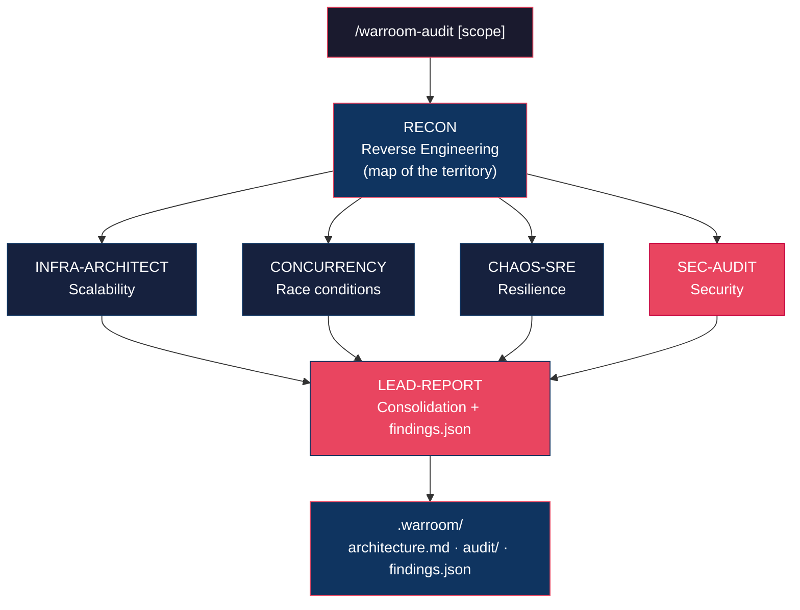

<div align="center">

# Claude War Room

**Instant, trustworthy context for any legacy codebase — right inside Claude Code.**

[](https://github.com/RandMelville/claude-war-room/actions)
[](LICENSE)
[](https://docs.anthropic.com/en/docs/claude-code)
[]()
[](CONTRIBUTING.md)

**🇺🇸 English** | [🇧🇷 Português](README.pt-br.md)

**Inherited a repo with no docs, no context, nobody to ask? Point the War Room at it.**

</div>

---

> You lead teams with legacy repositories nobody documented. The **War Room** walks into that
> unknown territory and hands you back a trustworthy map: what the system does, how it works, the
> business rules, and where the landmines are — in minutes, persisted as living documentation the
> whole team inherits.

---

## Install

As of v2.0, War Room is a **Claude Code plugin**. Inside Claude Code:

```
/plugin marketplace add RandMelville/claude-war-room
/plugin install claude-war-room
```

Prerequisite: the [Claude Code CLI](https://docs.anthropic.com/en/docs/claude-code).
No `git clone`, no internal path editing, no script.

> Coming from v1? See [Migrating from v1](#migrating-from-v1).

---

## Two commands

### `/warroom` — Recon (the hero)

```
/warroom                # map the whole repository
/warroom src/billing    # focus on a module/feature
```

Runs the **Recon** agent (reverse engineering) and **persists** living docs to `.warroom/`:
stack, flows with Mermaid diagrams, integrations, business rules and tech debt. This is what you
run on day 1 of a legacy repo.

### `/warroom-audit` — full War Room

```
/warroom-audit                # 360° risk audit
/warroom-audit Authentication # focus on a feature
```

Reuses Recon's map and fans out **6 agents** (4 specialists **in parallel** + consolidation) to
produce a **Confidence Report** with severities and an action plan, plus structured `findings.json`.

---

## How it works



**Map → parallel fan-out → reduce.** Recon builds the map; the 4 specialists analyze it in parallel
(each with a deliberate bias); the Lead consolidates everything into business language. Running in
parallel cuts time and avoids blowing the context window — the bottleneck of v1's sequential mode.

---

## The 6 Agents

| # | Agent | What it does | Output |
|---|-------|--------------|--------|
| 1 | **Recon** | Maps flows, business rules and architecture from code | Architecture doc with Mermaid diagrams |
| 2 | **Scalability Architect** | Finds infra bottlenecks, connection limits, missing cache | Bottleneck inventory + load simulation |
| 3 | **Concurrency Specialist** | Hunts race conditions, deadlocks, inconsistencies | Write map + locking recommendations |
| 4 | **Chaos Engineer / SRE** | Simulates catastrophic failures, assesses resilience | Disaster catalog + resilience plan |
| 5 | **Security Auditor** | Audits OWASP Top 10, secrets, authz, privacy (LGPD/GDPR) | Vulnerabilities + remediation plan |
| 6 | **Quality & Stability Lead** | Consolidates everything into business language | Confidence Report + `findings.json` |

---

## What gets generated (`.warroom/`)

Artifacts are created **in the repo you analyze** and are designed to be **committed** — the whole
team inherits the context.

```
.warroom/
├── architecture.md   # living docs (Recon)
├── manifest.json     # analyzed files + hashes + commit (drift baseline)
├── findings.json     # structured findings (severity, evidence, status)
└── audit/            # specialist outputs + Confidence Report (only with /warroom-audit)
```

See a real example in [`examples/`](examples/).

---

## Domains

Agents are **domain-agnostic** by default. To reintroduce a specific vocabulary (terms, scale
metrics, regulation), use a **domain pack** — see [`packs/edtech`](packs/edtech/README.md) as an
example and template for FinTech, HealthTech, etc.

---

## Migrating from v1

v1 installed agents manually into `~/.claude/agents/` and triggered everything with the phrase
`ativar modo war room: [feature]` via a memory file. **That's been replaced:**

| v1 | v2.0 |
|----|------|
| `git clone` + `install.sh` | `/plugin install` |
| `ativar modo war room: X` | `/warroom-audit X` |
| Sequential run (blew the context window) | Parallel fan-out |
| Chat-only output | Persisted to `.warroom/` (committable) |
| EdTech-coupled | Agnostic core + domain packs |

---

## Roadmap

- **v2.1 — Trust:** adversarial verification of findings (kills false positives), calibrated
  severity rubric, eval harness in CI.
- **v2.2 — Scale:** `/warroom-refresh` (drift detection via `manifest.json`), multi-repo analysis
  and portfolio view.

---

## Contributing

Contributions welcome! Read the [Contributing Guide](CONTRIBUTING.md). Ideas: new agents
(Performance Profiler, Accessibility Auditor), new domain packs, anonymized real examples, output
template improvements.

---

<div align="center">

**Built by [@RandMelville](https://github.com/RandMelville)** · [MIT](LICENSE)

</div>
