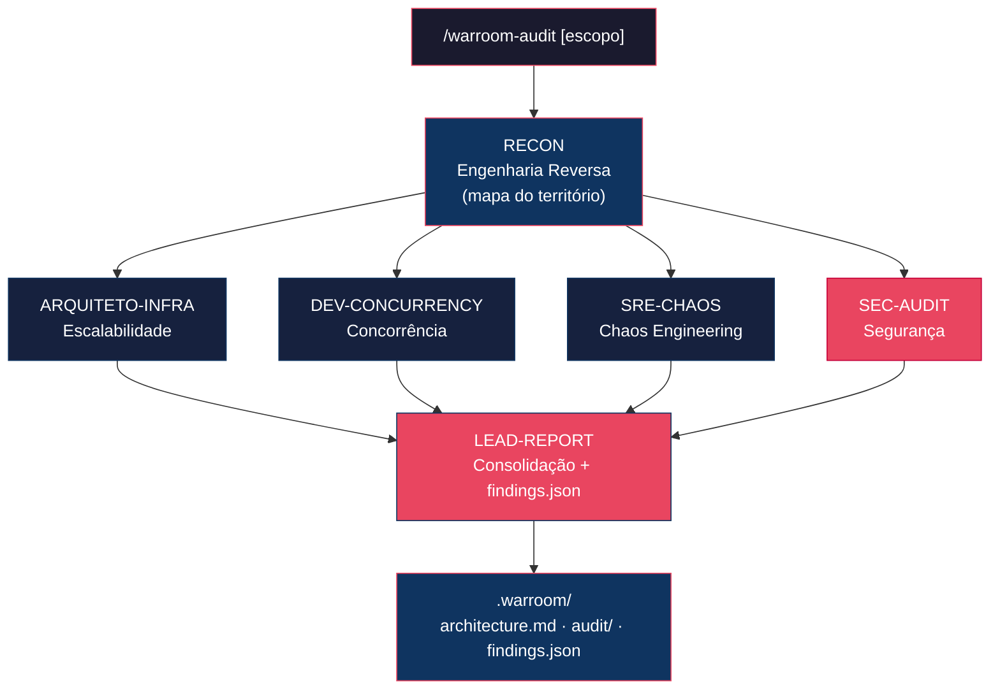

<div align="center">

# Claude War Room

**Contexto instantâneo e confiável de qualquer codebase legado — direto no Claude Code.**

[](https://github.com/RandMelville/claude-war-room/actions)
[](LICENSE)
[](https://docs.anthropic.com/en/docs/claude-code)
[]()
[](CONTRIBUTING.md)
[]()

**🇧🇷 Português** | [🇺🇸 English](README.en.md)

**Herdou um repo sem doc, sem contexto, sem ninguém pra explicar? Aponte o War Room nele.**

</div>

---

> Você lidera times com repositórios legados que ninguém documentou. O **War Room** entra nesse
> território desconhecido e devolve um mapa confiável: o que o sistema faz, como funciona, quais as
> regras de negócio e onde estão as minas terrestres — em minutos, persistido como documentação viva
> que o time inteiro herda.

<table>
<tr>
<td align="center"><b>Recon primeiro</b><br/>Doc viva do codebase em 1 comando</td>
<td align="center"><b>War Room sob demanda</b><br/>6 agentes caçando riscos em paralelo</td>
<td align="center"><b>Persistente</b><br/>Tudo salvo em <code>.warroom/</code></td>
<td align="center"><b>Domínio-agnóstico</b><br/>Packs opcionais (EdTech…)</td>
</tr>
</table>

---

## Instalação

A partir da v2.0, o War Room é um **plugin** do Claude Code. No Claude Code:

```
/plugin marketplace add RandMelville/claude-war-room
/plugin install claude-war-room
```

Pré-requisitos: [Claude Code CLI](https://docs.anthropic.com/en/docs/claude-code) instalado.
Sem `git clone`, sem editar caminhos internos, sem script.

> Vindo da v1? Veja [Migração do v1](#migração-do-v1).

---

## Os dois comandos

### `/warroom` — Recon (o herói)

```
/warroom                # mapeia o repositório inteiro
/warroom src/billing    # foca num módulo/feature
```

Roda o agente **Recon** (engenharia reversa) e **persiste** a doc viva em `.warroom/`:
stack, fluxos com diagramas Mermaid, integrações, regras de negócio e dívida técnica.
É o que você roda no dia 1 de um repo legado.

### `/warroom-audit` — War Room completo

```
/warroom-audit                  # auditoria 360° de riscos
/warroom-audit Autenticação     # foca numa feature
```

Reusa o mapa do Recon e dispara **6 agentes** (4 especialistas **em paralelo** + consolidação) para
produzir um **Report de Confiança** com severidades e plano de ação, mais `findings.json` estruturado.

---

## Como funciona



**Map → fan-out paralelo → reduce.** O Recon cria o mapa; os 4 especialistas o analisam em paralelo
(cada um com um viés proposital); o Lead consolida tudo em linguagem de negócio. Rodar em paralelo
corta tempo e evita estourar a janela de contexto — o gargalo do modo sequencial do v1.

---

## Os 6 Agentes

| # | Agente | O que faz | O que produz |
|---|--------|-----------|--------------|
| 1 | **Recon** | Mapeia fluxos, regras de negócio e arquitetura a partir do código | Doc de arquitetura com diagramas Mermaid |
| 2 | **Scalability Architect** | Identifica gargalos de infra, limites de conexão, falta de cache | Inventário de gargalos + simulação de carga |
| 3 | **Concurrency Specialist** | Caça race conditions, deadlocks e inconsistências | Mapa de escritas + recomendações de locking |
| 4 | **Chaos Engineer / SRE** | Simula falhas catastróficas e avalia resiliência | Catálogo de desastres + plano de resiliência |
| 5 | **Security Auditor** | Audita OWASP Top 10, secrets, authz e privacidade (LGPD/GDPR) | Vulnerabilidades + plano de remediação |
| 6 | **Quality & Stability Lead** | Consolida tudo em linguagem de negócio | Report de Confiança + `findings.json` |

---

## O que é gerado (`.warroom/`)

Os artefatos são criados **no repositório que você analisa** e foram desenhados para serem
**commitados** — o time inteiro herda o contexto.

```
.warroom/
├── architecture.md   # doc viva (Recon)
├── manifest.json     # arquivos analisados + hashes + commit (base de drift)
├── findings.json     # achados estruturados (severidade, evidência, status)
└── audit/            # saídas dos especialistas + Report de Confiança (só com /warroom-audit)
```

Veja um exemplo real em [`examples/`](examples/). Os Markdown renderizam direto no GitHub,
Confluence, Notion ou qualquer viewer (diagramas Mermaid inclusos).

---

## Domínios

Os agentes são **neutros ao domínio** por padrão. Para reintroduzir um vocabulário específico
(termos, métricas de escala, regulação), use um **domain pack** — veja
[`packs/edtech`](packs/edtech/README.md) como exemplo e template para FinTech, HealthTech, etc.

---

## Migração do v1

O v1 instalava agentes manualmente em `~/.claude/agents/` e ativava tudo com a frase
`ativar modo war room: [feature]` via um arquivo de memória. **Isso foi substituído:**

| v1 | v2.0 |
|----|------|
| `git clone` + `install.sh` | `/plugin install` |
| `ativar modo war room: X` | `/warroom-audit X` |
| Execução sequencial (estourava contexto) | Fan-out paralelo |
| Saída só no chat | Persistida em `.warroom/` (commitável) |
| Acoplado a EdTech | Core agnóstico + domain packs |

Pode remover o trigger de memória antigo e os agentes copiados à mão — o plugin cuida de tudo.

---

## Roadmap

- **v2.1 — Confiança:** verificação adversarial dos achados (mata falso-positivo), rubrica de
  severidade calibrada, eval harness na CI.
- **v2.2 — Escala:** `/warroom-refresh` (detecção de drift via `manifest.json`), análise multi-repo
  e visão de portfólio.

---

## Contribuição

Contribuições são bem-vindas! Leia o [Guia de Contribuição](CONTRIBUTING.md). Algumas ideias:
novos agentes (Performance Profiler, Accessibility Auditor), novos domain packs, exemplos reais
anonimizados, melhorias nos templates de saída.

---

## Star History

[](https://star-history.com/#RandMelville/claude-war-room&Date)

---

<div align="center">

**Construído por [@RandMelville](https://github.com/RandMelville)** · [MIT](LICENSE)

</div>
