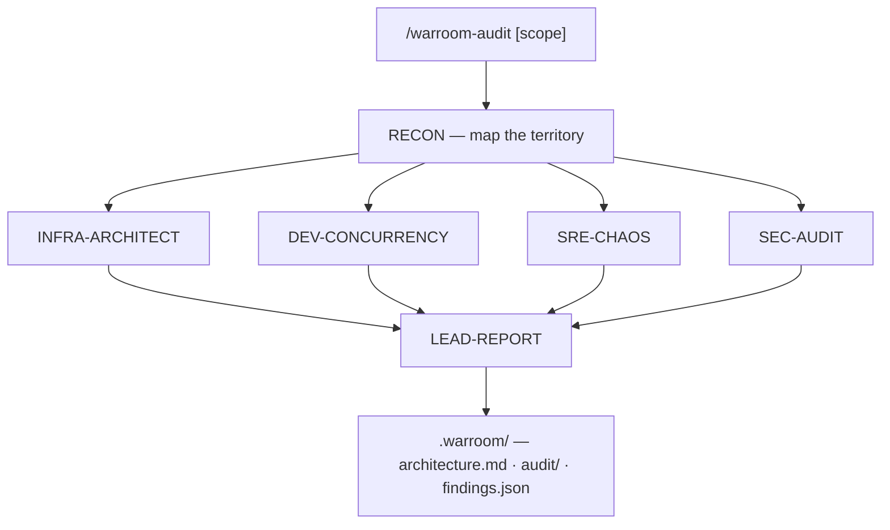

# War Room Architecture

## Overview

War Room is a **Claude Code plugin** that orchestrates specialized agents via **slash commands**. It is not a framework or library — it's a set of configuration files (`commands/` + `agents/`) that turn Claude Code into an automated and **persistent** analysis pipeline (`.warroom/`).

Two commands:
- `/warroom` → runs **Recon** (reverse engineering) and writes the living documentation.
- `/warroom-audit` → runs the full War Room: Recon + 4 specialists **in parallel** + consolidation.

## Orchestration Pattern

### Why map → parallel fan-out → reduce?

The real dependency is **one-to-many**, not a chain:

1. **Recon first (map)** — Builds the map of the territory. Without understanding the architecture, the other agents don't know what to analyze. **Every** specialist depends on it.
2. **4 specialists in parallel (fan-out)** — Infra, concurrency, chaos, and security are **independent of each other**: each one re-analyzes the same map through its own lens. Running them in parallel cuts time and **avoids blowing the context window** that v1's sequential mode caused on real codebases.
3. **Lead last (reduce)** — Needs ALL findings to prioritize by business impact and emit `findings.json`.

> In v1 the 6 agents ran sequentially in the same conversation, which is exactly what exhausted the context. v2 swaps the chain for a parallel fan-out.

### Context Passing

The `/warroom-audit` command (in `commands/warroom-audit.md`) orchestrates the flow: it reads the
`.warroom/architecture.md` produced by Recon and passes it as context to the **4 parallel calls**
of the `Agent` tool (one per specialist). The 4 outputs, plus the map, are then passed to the
`quality-stability-lead` for consolidation.

---

## Deep Dive: Each Agent

### Agent 1: Recon (Reverse Engineering & Software Architect)

**File:** `agents/recon.md`

**Purpose:** Create the technical documentation that was never written. It's the "cartographer" of the War Room.

**Execution phases:**
1. **Scan and Collect** — Reads source code, migrations, configs, tests. Maps imports, queries, events.
2. **Analyze and Document** — Generates the document following a mandatory template.

**Mandatory output:**
- Feature Overview
- Stack Mapping (table)
- Flow Architecture with a Mermaid diagram (`sequenceDiagram`)
- Integration Points (reads and writes)
- Technical Debt and Bottlenecks (table with severity)
- Glossary of Business Rules

**Tools:** Read, Glob, Grep, Bash, Agent

**Key guidelines:**
- Never invents information — if it can't be determined from the code, it says so explicitly
- Every claim backed by a `file:line` reference
- Mermaid diagrams mandatory

---

### Agent 2: INFRA-ARCHITECT (Cloud Scalability Architect)

**File:** `agents/scalability-architect.md`

**Purpose:** Find where the system will break under load. It's the "stress engineer" of the War Room.

**Execution phases:**
1. **Infrastructure Mapping** — Reads configs (application.yml, docker-compose, k8s), connection pools, timeouts.
2. **Bottleneck Analysis** — For each bottleneck: estimated load vs limit, breaking point, cascade effect.
3. **Delivery** — Inventory + load simulation.

**Mandatory output:**
- Executive Summary with classification (Critical/Concerning/Adequate)
- Flow Map with Bottlenecks (Mermaid diagram annotated with bottlenecks)
- Bottleneck Inventory (table)
- Detailed Analysis per Bottleneck
- Load Simulation with 1,000 concurrent users (table)
- Action Plan to Scale (P0/P1/P2)

**Key metric:** Always simulates with 1,000 concurrent users (customizable).

---

### Agent 3: DEV-CONCURRENCY (Concurrency & Distributed Systems Specialist)

**File:** `agents/concurrency-specialist.md`

**Purpose:** Hunt race conditions and deadlocks before they corrupt data. It's the "data paranoid" of the War Room.

**Execution phases:**
1. **Write Point Mapping** — Identifies INSERT/UPDATE/DELETE, endpoints that trigger writes, multiple paths to the same record.
2. **Concurrency Analysis** — Mentally simulates 2 concurrent requests at each write point.
3. **Delivery** — Race condition scenarios + locking recommendations.

**Mandatory output:**
- Risk Summary (High/Medium/Low)
- Write Point Map (Mermaid diagram)
- Race Condition Analysis with temporal sequences (T1, T2)
- Transaction Analysis (current vs recommended isolation level)
- Deadlock Analysis
- Locking Recommendations (Optimistic vs Pessimistic with rationale)
- Idempotency Checklist

**Differentiator:** Simulates scenarios with temporal diagrams showing exactly how data gets corrupted.

---

### Agent 4: SRE-CHAOS (Chaos Engineer SRE)

**File:** `agents/chaos-engineer-sre.md`

**Purpose:** Simulate the worst possible day. It's the "professional pessimist" of the War Room.

**Execution phases:**
1. **Failure Surface Mapping** — External calls, long-running processes, timeout/retry/circuit breaker configs.
2. **Disaster Simulation** — For each point: what happens immediately, after 5 min, when it recovers.
3. **Delivery** — Disaster catalog + resilience plan.

**Mandatory output:**
- Resilience Verdict (Fragile/Partially Resilient/Resilient)
- Failure Surface Map (Mermaid diagram)
- Disaster Scenario Catalog (with temporal sequence T+0, T+30s, T+5min)
- Timeout and Retry Analysis (table)
- Long-Running Process Analysis
- Resilience Plan (P0/P1/P2)

**Differentiator:** Presents each scenario with its blast radius and a temporal degradation sequence.

---

### Agent 5: SEC-AUDIT (Security Auditor)

**File:** `agents/security-auditor.md`

**Purpose:** Find exploitable vulnerabilities before an attacker does. It's the "ethical hacker" of the War Room.

**Execution phases:**
1. **Attack Surface Reconnaissance** — Uses Recon's map to identify entry points, auth flows, and sensitive data.
2. **Vulnerability Analysis** — For each entry point: input validation, authorization checks, data encryption, information leakage in errors.
3. **Delivery** — Vulnerability catalog with attack vectors and a remediation plan.

**Mandatory output:**
- Security Verdict (Critical/Attention/Secure)
- Attack Surface Map (Mermaid diagram)
- Vulnerability Catalog (OWASP table + step-by-step attack vector + vulnerable code + fix)
- Authentication and Authorization Analysis (endpoint × checks)
- Secrets and Configuration Audit (table of exposed items)
- Dependency Analysis (known CVEs)
- Remediation Plan (P0/P1/P2 with LGPD impact)

**Differentiator:** Presents each vulnerability with a step-by-step attack vector and fixed code, and highlights LGPD implications for minors' data.

---

### Agent 6: LEAD-REPORT (Quality & Stability Lead)

**File:** `agents/quality-stability-lead.md`

**Purpose:** Translate everything into business language and prioritize by impact. It's the "translator" of the War Room.

**Execution phases:**
1. **Evidence Gathering** — Reads the analyses from all previous agents.
2. **Impact-Based Prioritization** — Ranks by: data loss > unavailability > degradation > technical debt.
3. **Delivery** — Confidence Report with an action plan.

**Mandatory output:**
- Confidence Report (Index: Low/Moderate/High)
- Executive Summary (2-3 sentences for non-technical readers)
- Severity Table (problem in business language + technical risk)
- Per-Problem Breakdown (what the user sees, what happens under the hood, the fix)
- Immediate Action Plan (This week / 2 weeks / Next sprint)
- Tracking Metrics
- Risks of Not Acting

**Final contract:** Mandatory table with columns:
`Component | Detected Failure | Severity (1-10) | Short-Term Action`

---

## Tools Used

All agents use the same toolset:

| Tool | Use in the War Room |
|-----------|-----------------|
| **Read** | Read code files, configs, migrations |
| **Glob** | Find files by pattern (e.g. `**/*.kt`, `**/application.yml`) |
| **Grep** | Search code for patterns (e.g. `@Transactional`, `SELECT FOR UPDATE`) |
| **Bash** | Run system commands (e.g. check versions, list structure) |
| **Agent** | Delegate sub-tasks for deeper exploration |

---

## Known Limitations

1. **Context** — The parallel fan-out greatly relieves v1's context blowup, but giant codebases still benefit from narrowing down with the scope argument (e.g. `/warroom-audit src/billing`).
2. **Model** — **Recon** uses `model: sonnet` (cheap, high frequency); the 4 specialists and the Lead use `model: opus` (depth where it matters). Adjustable in each agent's frontmatter.
3. **Static reading** — The agents analyze static code. They don't run tests, don't access the production database, and don't do real profiling.
4. **Unverified findings** — In v2.0 findings come out with `verified: false`. The adversarial verification that kills false positives lands in v2.1.
5. **Domain** — The core is domain-agnostic. To reintroduce domain-specific vocabulary, use a domain pack (e.g. [`packs/edtech`](../packs/edtech/README.md)). See also [CUSTOMIZATION.md](CUSTOMIZATION.md).
