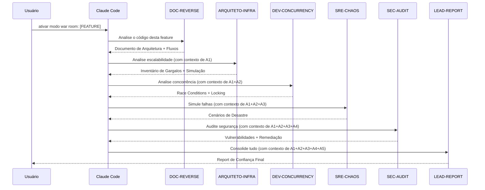

# Arquitetura do War Room

## Visão Geral

O Modo War Room é um **orquestrador sequencial de agentes** implementado como uma configuração de memória do Claude Code. Não é um framework ou biblioteca — são arquivos de configuração que transformam o Claude Code em um pipeline de análise automatizada.

## Padrão de Orquestração

### Por que sequencial?

A ordem não é arbitrária:

1. **DOC-REVERSE primeiro** — Cria o mapa do território. Sem entender a arquitetura, os outros agentes não sabem o que analisar.
2. **ARQUITETO-INFRA segundo** — Identifica os limites físicos do sistema. O especialista em concorrência precisa saber onde estão os gargalos de conexão.
3. **DEV-CONCURRENCY terceiro** — Com o mapa de fluxos (A1) e os pontos de pressão (A2), pode simular race conditions nos pontos certos.
4. **SRE-CHAOS quarto** — Usa todos os dados anteriores para simular falhas realistas, não hipotéticas.
5. **SEC-AUDIT quinto** — Com o mapa completo de arquitetura, gargalos, concorrência e falhas, audita segurança sabendo exatamente onde estão as superfícies de ataque.
6. **LEAD-REPORT último** — Precisa de TODAS as descobertas para priorizar por impacto de negócio.

### Passagem de Contexto

O mecanismo é simples: todos os agentes rodam **na mesma conversa do Claude Code**. A saída de cada agente fica no contexto da conversa, e o próximo agente tem acesso automático a ela.

O arquivo `feedback_war_room_mode.md` define a regra:
> *"Processar sequencialmente: cada agente recebe o contexto + descobertas dos anteriores"*

---

## Deep Dive: Cada Agente

### Agente 1: DOC-REVERSE (Reverse Engineering & Software Architect)

**Arquivo:** `agents/01-reverse-engineering-architect.md`

**Propósito:** Criar a documentação técnica que nunca foi escrita. É o "cartógrafo" do War Room.

**Fases de execução:**
1. **Varredura e Coleta** — Lê código-fonte, migrations, configs, testes. Mapeia imports, queries, eventos.
2. **Análise e Documentação** — Gera o documento seguindo template obrigatório.

**Output obrigatório:**
- Visão Geral da Feature
- Mapeamento de Stack (tabela)
- Arquitetura de Fluxo com diagrama Mermaid (`sequenceDiagram`)
- Pontos de Integração (leitura e escrita)
- Dívida Técnica e Gargalos (tabela com severidade)
- Glossário de Regras de Negócio

**Ferramentas:** Read, Glob, Grep, Bash, Agent

**Diretrizes-chave:**
- Nunca inventa informação — se não dá para determinar pelo código, declara explicitamente
- Toda afirmação com referência `arquivo:linha`
- Diagramas Mermaid obrigatórios

---

### Agente 2: ARQUITETO-INFRA (Cloud Scalability Architect)

**Arquivo:** `agents/02-scalability-architect.md`

**Propósito:** Encontrar onde o sistema vai quebrar sob carga. É o "engenheiro de estresse" do War Room.

**Fases de execução:**
1. **Mapeamento de Infraestrutura** — Lê configs (application.yml, docker-compose, k8s), pools de conexão, timeouts.
2. **Análise de Gargalos** — Para cada gargalo: carga estimada vs limite, ponto de ruptura, efeito cascata.
3. **Entrega** — Inventário + simulação de carga.

**Output obrigatório:**
- Resumo Executivo com classificação (Crítico/Preocupante/Adequado)
- Mapa de Fluxo com Gargalos (diagrama Mermaid com anotações de bottleneck)
- Inventário de Gargalos (tabela)
- Análise Detalhada por Gargalo
- Simulação de Carga com 1.000 acessos simultâneos (tabela)
- Plano de Ação para Escalar (P0/P1/P2)

**Métrica-chave:** Sempre simula com 1.000 acessos simultâneos (customizável).

---

### Agente 3: DEV-CONCURRENCY (Concurrency & Distributed Systems Specialist)

**Arquivo:** `agents/03-concurrency-specialist.md`

**Propósito:** Caçar race conditions e deadlocks antes que eles corrompam dados. É o "paranóico de dados" do War Room.

**Fases de execução:**
1. **Mapeamento de Pontos de Escrita** — Identifica INSERT/UPDATE/DELETE, endpoints que disparam escritas, múltiplos caminhos para o mesmo registro.
2. **Análise de Concorrência** — Simula mentalmente 2 requests simultâneos em cada ponto de escrita.
3. **Entrega** — Cenários de race condition + recomendações de locking.

**Output obrigatório:**
- Resumo de Risco (Alto/Médio/Baixo)
- Mapa de Pontos de Escrita (diagrama Mermaid)
- Análise de Race Conditions com sequências temporais (T1, T2)
- Análise de Transações (nível de isolamento atual vs recomendado)
- Análise de Deadlocks
- Recomendações de Locking (Optimistic vs Pessimistic com justificativa)
- Checklist de Idempotência

**Diferencial:** Simula cenários com diagramas temporais mostrando exatamente como o dado se corrompe.

---

### Agente 4: SRE-CHAOS (Chaos Engineer SRE)

**Arquivo:** `agents/04-chaos-engineer-sre.md`

**Propósito:** Simular o pior dia possível. É o "pessimista profissional" do War Room.

**Fases de execução:**
1. **Mapeamento de Superfície de Falha** — Chamadas externas, processos longos, configs de timeout/retry/circuit breaker.
2. **Simulação de Desastres** — Para cada ponto: o que acontece imediatamente, após 5 min, quando volta.
3. **Entrega** — Catálogo de desastres + plano de resiliência.

**Output obrigatório:**
- Veredito de Resiliência (Frágil/Parcialmente Resiliente/Resiliente)
- Mapa de Superfície de Falha (diagrama Mermaid)
- Catálogo de Cenários de Desastre (com sequência temporal T+0, T+30s, T+5min)
- Análise de Timeouts e Retries (tabela)
- Análise de Processos Longos
- Plano de Resiliência (P0/P1/P2)

**Diferencial:** Apresenta cada cenário com blast radius e sequência temporal de degradação.

---

### Agente 5: SEC-AUDIT (Security Auditor)

**Arquivo:** `agents/05-security-auditor.md`

**Propósito:** Encontrar vulnerabilidades exploráveis antes que um atacante as encontre. É o "hacker ético" do War Room.

**Fases de execução:**
1. **Reconhecimento de Superfície de Ataque** — Usa o mapa do DOC-REVERSE para identificar pontos de entrada, fluxos de auth e dados sensíveis.
2. **Análise de Vulnerabilidades** — Para cada ponto de entrada: validação de input, verificação de autorização, criptografia de dados, vazamento de informações em erros.
3. **Entrega** — Catálogo de vulnerabilidades com vetores de ataque e plano de remediação.

**Output obrigatório:**
- Veredito de Segurança (Crítico/Atenção/Seguro)
- Mapa de Superfície de Ataque (diagrama Mermaid)
- Catálogo de Vulnerabilidades (tabela OWASP + vetor de ataque passo a passo + código vulnerável + correção)
- Análise de Autenticação e Autorização (endpoint × checks)
- Auditoria de Secrets e Configuração (tabela de itens expostos)
- Análise de Dependências (CVEs conhecidas)
- Plano de Remediação (P0/P1/P2 com impacto LGPD)

**Diferencial:** Apresenta cada vulnerabilidade com vetor de ataque passo a passo e código corrigido, e destaca implicações LGPD para dados de menores.

---

### Agente 6: LEAD-REPORT (Quality & Stability Lead)

**Arquivo:** `agents/06-quality-stability-lead.md`

**Propósito:** Traduzir tudo para linguagem de negócio e priorizar por impacto. É o "tradutor" do War Room.

**Fases de execução:**
1. **Coleta de Evidências** — Lê as análises de todos os agentes anteriores.
2. **Priorização por Impacto** — Classifica por: perda de dados > indisponibilidade > degradação > dívida técnica.
3. **Entrega** — Report de Confiança com plano de ação.

**Output obrigatório:**
- Report de Confiança (Índice: Baixo/Moderado/Alto)
- Resumo Executivo (2-3 frases para não-técnicos)
- Tabela de Severidade (problema em linguagem de negócio + risco técnico)
- Detalhamento por Problema (o que o usuário vê, o que acontece por baixo, correção)
- Plano de Ação Imediato (Esta semana / 2 semanas / Próximo sprint)
- Métricas de Acompanhamento
- Riscos de Não Agir

**Contrato final:** Tabela obrigatória com colunas:
`Componente | Falha Detectada | Severidade (1-10) | Ação de Curto Prazo`

---

## Ferramentas Utilizadas

Todos os agentes usam o mesmo conjunto de ferramentas:

| Ferramenta | Uso no War Room |
|-----------|-----------------|
| **Read** | Ler arquivos de código, configs, migrations |
| **Glob** | Encontrar arquivos por padrão (ex: `**/*.kt`, `**/application.yml`) |
| **Grep** | Buscar padrões no código (ex: `@Transactional`, `SELECT FOR UPDATE`) |
| **Bash** | Executar comandos do sistema (ex: verificar versões, listar estrutura) |
| **Agent** | Delegar sub-tarefas para exploração mais profunda |

---

## Limitações Conhecidas

1. **Contexto da conversa** — Em codebases muito grandes, os 6 agentes podem esgotar a janela de contexto. Recomendação: foque em features/módulos específicos.
2. **Modelo** — Todos os agentes usam `model: opus`. Sonnet funciona, mas com menor profundidade de análise.
3. **Leitura estática** — Os agentes analisam código estático. Não executam testes, não acessam banco de dados em produção, não fazem profiling real.
4. **Domínio** — Os templates vêm otimizados para EdTech. Para outros domínios, veja [CUSTOMIZATION.md](CUSTOMIZATION.md).
