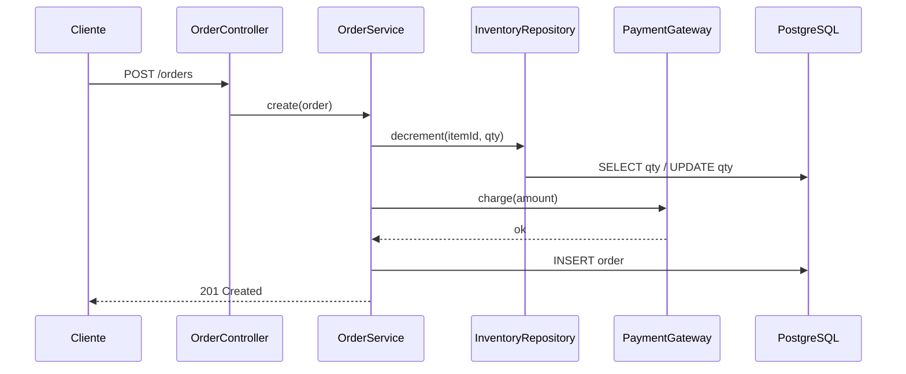

<!-- Exemplo ILUSTRATIVO (sistema de pedidos fictício). Gerado por /warroom (Recon). -->

# Arquitetura — Módulo de Pedidos (sample)

## 1. Visão Geral

Módulo de checkout de um e-commerce: cria pedidos, decrementa estoque e cobra via gateway de
pagamento externo. Usuário final: clientes da loja.

## 2. Mapeamento de Stack

| Camada     | Tecnologia    | Versão | Observação                     |
|------------|---------------|--------|--------------------------------|
| Linguagem  | Java          | 17     | —                              |
| Framework  | Spring Boot   | 3.2    | REST                           |
| Banco      | PostgreSQL    | 15     | HikariCP pool=10               |
| Pagamento  | Gateway HTTP  | N/A    | chamada síncrona, sem timeout  |

## 3. Arquitetura de Fluxo



### Passos
1. `OrderController.create` recebe o pedido — `src/orders/OrderService.java:40`
2. Decremento de estoque — `src/orders/InventoryRepository.java:58`
3. Cobrança no gateway — `src/orders/OrderService.java:84`
4. Persistência do pedido — `src/orders/OrderService.java:110`

## 4. Pontos de Integração

### Escrita (Produz para):
| Serviço/Tabela | Tipo | Protocolo | Observação           |
|----------------|------|-----------|----------------------|
| inventory      | DB   | SQL       | UPDATE sem lock      |
| orders         | DB   | SQL       | INSERT               |
| PaymentGateway | API  | REST      | síncrono, sem timeout|

## 5. Dívida Técnica e Minas Terrestres

| # | Tipo               | Localização                              | Severidade | Descrição                          |
|---|--------------------|------------------------------------------|------------|------------------------------------|
| 1 | Race condition     | `src/orders/InventoryRepository.java:58` | Crítica    | decremento de estoque sem lock     |
| 2 | Sem timeout        | `src/orders/OrderService.java:84`        | Alta       | chamada de pagamento pode pendurar |
| 3 | Broken access ctrl | `src/orders/OrderService.java:121`       | Alta       | IDOR no GET /orders/{id}           |

## 6. Glossário de Regras de Negócio

| # | Regra                                  | Localização                       | Tipo      |
|---|----------------------------------------|-----------------------------------|-----------|
| 1 | Estoque não pode ficar negativo        | `InventoryRepository.java:58`     | Restrição |
| 2 | Pedido só confirma após pagamento ok   | `OrderService.java:84`            | Validação |

## 7. Arquivos Analisados

```
src/orders/OrderService.java
src/orders/InventoryRepository.java
src/main/resources/application.yml
```
