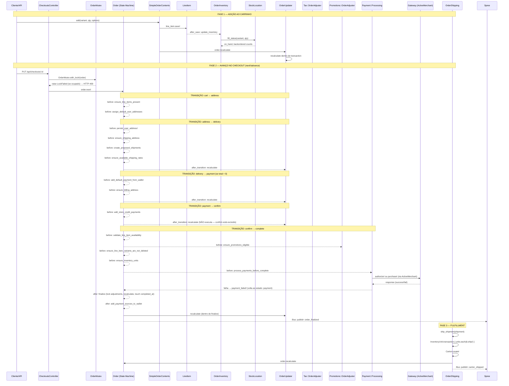

<!-- Exemplo REAL. Gerado por /warroom (Recon, modelo sonnet) sobre o módulo de pedidos/checkout
     do Solidus (e-commerce Rails OSS) — github.com/solidusio/solidus @ 8d781ac (2026-06-09).
     Escopo: core/app/models/spree/order* + state machines + payment/inventory.
     Todas as afirmações têm evidência arquivo:linha no código do Solidus. -->

# Arquitetura — Módulo de Pedidos/Checkout (Solidus)

## 1. Visão Geral

O módulo de pedidos/checkout do Solidus (versão `4.8.0.dev`, Rails `>= 7.2`) é o núcleo transacional do sistema. `Spree::Order` é um objeto dual: carrinho de compras enquanto incompleto, e registro permanente após conclusão. O ciclo de vida é controlado por uma state machine customizável integrada ao ActiveRecord via a gem `state_machines-activerecord`. Todo recálculo de totais, impostos e promoções passa por um objeto de serviço separado (`OrderUpdater` / `InMemoryOrderUpdater`). A concorrência é gerenciada por uma tabela de lock otimista (`spree_order_mutexes`), não por locks do banco de dados. Todos os gateways de pagamento são integrados via ActiveMerchant.

---

## 2. Mapeamento de Stack

| Camada | Tecnologia | Versão | Observação |
|---|---|---|---|
| Framework | Ruby on Rails | >= 7.2 | Declarado em `core/lib/spree/core/version.rb:8` |
| Solidus | solidus gem | 4.8.0.dev | `core/lib/spree/core/version.rb:4` |
| State Machine | state_machines-activerecord | N/D (gem dep) | Incluído via `Spree::Config.state_machines.order` em `core/app/models/spree/order.rb:26` |
| ORM | ActiveRecord | Rails-bundled | Todos os modelos herdam de `Spree::Base < ActiveRecord::Base` |
| Gateway de Pagamento | ActiveMerchant | N/D | Usado em `core/app/models/spree/payment/processing.rb:43-46` |
| Bus de Eventos | Spree::Bus (Wisper-like) | Interno | Publicações em `order.rb`, `order_updater.rb`, `order_shipping.rb` |
| Lock de Concorrência | DB unique constraint (app-level mutex) | — | `core/app/models/spree/order_mutex.rb` — tabela `spree_order_mutexes` |
| Jobs Assíncronos | ActiveJob | Rails-bundled | `StateChangeTrackingJob.perform_later` em `order_updater.rb:208` e `in_memory_order_updater.rb:250` |

---

## 3. Arquitetura de Fluxo (Step-by-Step)



### Passos Detalhados

**1. Criação do Carrinho**
`Spree::Order` é criado com `state: :cart`. Callbacks `before_create` executam `create_token` (`order.rb:885`) e `link_by_email` (`order.rb:781`). Número único é gerado via `generate_order_number` (`order.rb:337`).

**2. Adição de Item**
`SimpleOrderContents#add` (`simple_order_contents.rb:22`) → `LineItem#save!` → callback `after_save :update_inventory` (`line_item.rb:35`) → `OrderInventory#verify` (`order_inventory.rb:20`) consulta `StockLocation#fill_status` (`stock_item.rb:38`, com `with_lock` no StockItem) para determinar `on_hand` vs `backordered`.

**3. Lock de Concorrência**
`CheckoutsController` declara `around_action :lock_order` (`checkouts_controller.rb:7`). `lock_order` chama `OrderMutex.with_lock!(order)` (`api/base_controller.rb:194`). O mutex tenta `create!` na tabela `spree_order_mutexes` (unique index em `order_id`). Se houver `RecordNotUnique`, lança `LockFailed` imediatamente — sem blocking, sem retry (`order_mutex.rb:22-27`). Locks expiram após `order_mutex_max_age` segundos (padrão: 120s) (`app_configuration.rb:214`).

**4. Transição de Estado**
A state machine (`class_methods.rb:38`) é declarada com `use_transactions: false` (`class_methods.rb:38`). As transições são definidas dinamicamente pelo `checkout_flow` (`order.rb:62-67`): `cart → address → delivery → payment (condicional) → confirm → complete`.

**5. Entrega (delivery)**
`before_transition to: :delivery` executa `create_proposed_shipments` (`order.rb:504`), que destroi shipments existentes e recria via `Spree::Config.stock.coordinator_class`. Em seguida, `ensure_available_shipping_rates` (`order.rb:837`) verifica que há taxas disponíveis.

**6. Pagamento**
`add_store_credit_payments` (`order.rb:585`) cria `Spree::Payment` records para créditos de loja disponíveis, invalidando pagamentos anteriores em checkout. Na transição para `:complete`, `process_payments_before_complete` (`order.rb:738`) chama `process_payments!` → itera `unprocessed_payments` (estado `:checkout`) → `payment.process!` (`payment/processing.rb:25`) → `purchase!` ou `authorize!` via ActiveMerchant gateway.

**7. Finalização**
Callback `after_transition to: :complete, do: :finalize` (`class_methods.rb:103`). `finalize` (`order.rb:758`): (a) finaliza todos os adjustments (`all_adjustments.each(&:finalize!)`); (b) recalcula `payment_state` e `shipment_state`; (c) salva o pedido; (d) toca `completed_at`; (e) publica `order_finalized` no event bus.

**8. Expedição**
`OrderShipping#ship` (`order_shipping.rb:45`) envolve `InventoryUnit.transaction` para transicionar units para `:shipped` e criar `Spree::Carton`. Atualiza estados dos shipments. Chama `order.recalculate`.

---

## 4. Pontos de Integração e Dependências

### Leitura (Read Dependencies)

| Componente Leitor | Dependência | Arquivo:Linha | Observação |
|---|---|---|---|
| `OrderUpdater#recalculate_payment_total` | `payments.completed.includes(:refunds)` | `order_updater.rb:151` | Carrega todos os payments completados com refunds |
| `OrderUpdater#determine_shipment_state` | `shipments.states` (pluck) | `order_updater.rb:98` | SELECT uniq dos estados de shipment |
| `Order#tax_address` | `Spree::Config[:tax_using_ship_address]`, `ship_address` / `bill_address` | `order.rb:274-278` | Configuração global de endereço de tributação |
| `Order#available_payment_methods` | `Spree::PaymentMethod.active.available_to_store(store)` | `order.rb:433-438` | Query com 3 escopos em cadeia, resultado memoizado |
| `Order#add_store_credit_payments` | `user.store_credits.where(currency:)` | `order.rb:598` | Leitura de créditos do usuário |
| `OrderInventory#determine_target_shipment` | `order.shipments.order(:created_at, :id)` | `order_inventory.rb:60` | N+1 potencial em contexto de múltiplos itens |
| `Payment#gateway_options` | `order.reload` (!) | `payment/processing.rb:116` | Reload forçado a cada chamada ao gateway |

### Escrita (Write Dependencies)

| Componente Escritor | Destino | Arquivo:Linha | Observação |
|---|---|---|---|
| `OrderUpdater#persist_totals` | `order.save!` (com callbacks) | `order_updater.rb:199` | Salva order com todos os callbacks ativos |
| `Order#finalize` | `all_adjustments.each(&:finalize!)`, `save!`, `touch :completed_at` | `order.rb:759-772` | Múltiplas escritas dentro da transição de estado |
| `Payment` (after_save) | `order.recalculate` | `payment.rb:31,201-204` | Recalcula order após CADA save de payment |
| `Shipment` (belongs_to touch) | `order.updated_at` | `shipment.rb:9` | Touch em order a cada save de shipment |
| `LineItem` (after_save) | `OrderInventory#verify` → StockItem | `line_item.rb:35-36` | Ajuste de estoque imediato após save |
| `OrderShipping#ship` | `Spree::Carton.create!`, `inventory_units.each(&:ship!)`, `order.recalculate` | `order_shipping.rb:49-75` | Tudo dentro de `InventoryUnit.transaction` |
| `OrderCancellations#short_ship` | `Spree::UnitCancel.create!`, `inventory_unit.cancel!`, `order.recalculate` | `order_cancellations.rb:49-59` | Envolto em `OrderMutex.with_lock!` |
| `Order#associate_user!` | `Order.unscoped.where(id:).update_all(attrs)` (bypass callbacks) | `order.rb:331` | `update_all` ignora callbacks e validações — intencional |

---

## 5. Dívida Técnica e Minas Terrestres

| # | Tipo | Localização (arquivo:linha) | Severidade | Descrição |
|---|---|---|---|---|
| 1 | **Concorrência** | `core/app/models/spree/core/state_machines/order/class_methods.rb:38` | CRÍTICA | `use_transactions: false` na state machine. Callbacks de transição que falham a meio caminho deixam o pedido em estado inconsistente sem rollback automático. Ex.: `finalize` escreve em múltiplas tabelas — se `save!` falhar após `all_adjustments.each(&:finalize!)`, os adjustments estão finalizados mas o pedido não. |
| 2 | **Concorrência** | `core/app/models/spree/order_mutex.rb:9,19` | ALTA | O mutex usa `delete_all` de locks expirados ANTES de tentar criar o lock (`order_mutex.rb:19`). Race condition: dois processos podem simultaneamente ver o lock como expirado, deletá-lo e ambos criarem com sucesso se o `RecordNotUnique` não for gerado atomicamente. O índice único mitiga, mas a janela de expiração/re-lock é problemática. |
| 3 | **Concorrência** | `core/app/models/spree/order_inventory.rb:22-37` | ALTA | `OrderInventory#verify` lê `inventory_units.count`, calcula `desired_quantity` e então escreve em stock — sem lock entre leitura e escrita. Dois processos simultâneos podem superestimar estoque disponível (TOCTOU - time-of-check to time-of-use). O `StockItem#adjust_count_on_hand` usa `with_lock` (`stock_item.rb:38`), mas o intervalo de check do inventário da ordem não está protegido. |
| 4 | **Performance (N+1)** | `core/app/models/spree/order_updater.rb:151` | ALTA | `payments.completed.includes(:refunds).sum { \|p\| p.amount - p.refunds.sum(:amount) }` — `includes(:refunds)` carrega refunds em memória, mas o bloco ainda chama `.sum(:amount)` sobre a associação, ignorando o eager load e gerando N queries adicionais. |
| 5 | **Callback Cascata** | `core/app/models/spree/payment.rb:31` (`after_save :update_order`) | ALTA | Toda gravação de `Payment` aciona `order.recalculate`, que por sua vez chama `order.save!`. Salvar múltiplos payments em sequência causa O(n) recálculos completos, cada um com sua própria transação aninhada e `persist_totals`. |
| 6 | **Touch Cascade** | `shipment.rb:9`, `payment.rb:16`, `inventory_unit.rb:12`, `adjustment.rb:10` | MÉDIA | Múltiplas associações com `touch: true` apontando para `Order`. Operação de expedição que atualiza N inventory units gera N UPDATE em `spree_orders.updated_at`, além dos recálculos. Em pedidos grandes, gera contenção em linha. |
| 7 | **Reload Forçado** | `core/app/models/spree/payment/processing.rb:116` | MÉDIA | `gateway_options` chama `order.reload` antes de cada transação com o gateway. Em um pedido com múltiplos payments, cada `process!` recarrega o objeto order do banco. Pode causar perda de mudanças não persistidas em memória. |
| 8 | **Segurança — PAN em Memória** | `core/app/models/spree/credit_card.rb:14,68-72` | INFORMACIONAL (positivo) | O número do cartão (`@number`) e CVV (`@verification_value`) são atributos transientes (`attr_reader`) — não persistidos no banco. Apenas `last_digits` e `cc_type` são armazenados. Correto para PCI DSS. Risco residual: o PAN reside em memória durante o processamento. |
| 9 | **Estado Inconsistente** | `core/app/models/spree/order.rb:527-530` | MÉDIA | `check_shipments_and_restart_checkout` usa `update_column` direto (sem callbacks) para resetar `state` e `shipment_total`. Se a chamada `self.next` na linha 543 falhar, o order fica em `state: cart` com o antigo `shipment_total`. |
| 10 | **Idempotência do Lock** | `core/app/models/spree/order_mutex.rb:15-33` | MÉDIA | `with_lock!` não é reentrante. Se um serviço que já detém o lock chamar outro serviço que também tenta o lock (ex.: `OrderCancellations#short_ship` dentro de `OrderCancellations#reimburse_units` — ambos chamam `with_lock!`), o segundo `create!` levantará `LockFailed` mesmo dentro da mesma thread/processo. |
| 11 | **Race em Promoções** | `core/app/models/spree/order.rb:808-816` | MÉDIA | `ensure_promotions_eligible` chama o adjuster com `persist: false` e verifica `promo_total_changed?`. Se duas requests concurrent chegarem ao step `confirm → complete` simultaneamente (antes do mutex ser efetivamente adquirido, ex. via backend admin que usa um mutex diferente), ambas podem passar a verificação e aplicar promoções duplicadas. |
| 12 | **Depreciações Acumuladas** | `core/app/models/spree/order.rb:284`, `order_updater.rb:34`, `in_memory_order_updater.rb:61` | BAIXA | Dezenas de `deprecate` com aliases (`updater`, `update`, `update_payment_state` etc.). Indica refatoração inacabada do `OrderUpdater → recalculator`. Dois recalculadores coexistem (`OrderUpdater` e `InMemoryOrderUpdater`) com lógica duplicada. |
| 13 | **Recálculo de Preço** | `core/app/models/spree/order_updater.rb:245-249` | MÉDIA | `recalculate_cart_prices` é um versioned preference com valor padrão `false` antes de `5.0.0.alpha` e `true` após (`app_configuration.rb:251`). Em versões anteriores à 5.0, preços de itens no carrinho **nunca são atualizados** durante recálculos, mesmo que o preço da variante mude — risco de cobrar preço desatualizado. |

---

## 6. Glossário de Regras de Negócio

| # | Regra | Localização | Tipo |
|---|---|---|---|
| 1 | Pedido requer ao menos um line item para avançar do estado `cart` | `order.rb:831-835` / `class_methods.rb:76` | Validação (before_transition) |
| 2 | Passo de pagamento é pulado se `total <= 0` | `order.rb:265` (`payment_required?`) / `order.rb:65` | Regra condicional de fluxo |
| 3 | Endereço de tributação é determinado por `tax_using_ship_address` (padrão: `true`) | `order.rb:273-278` | Configuração |
| 4 | Email é obrigatório a partir do estado `delivery` em diante | `order.rb:792-794` (`email_required?`) | Validação |
| 5 | Cancelamento só é permitido em pedidos completos com shipments em `ready/backorder/pending` | `order.rb:297-300` (`allow_cancel?`) | Guarda de estado |
| 6 | Promoções são aplicadas antes de impostos (ordem de atualização de adjustments) | `order_updater.rb:120` / `in_memory_order_updater.rb:144` | Ordem de processamento |
| 7 | Adjustments são "finalizados" (travados) ao completar o pedido | `order.rb:760` (`all_adjustments.each(&:finalize!)`) | Imutabilidade pós-complete |
| 8 | Créditos de loja são aplicados automaticamente na transição para `:confirm` | `class_methods.rb:70` + `order.rb:585-630` | Automação financeira |
| 9 | Mudança no `promo_total` antes de completar reinicia o checkout | `order.rb:811-813` | Proteção anti-race de promoção |
| 10 | Shipments são destruídos e recriados a cada transição para `:delivery` | `class_methods.rb:84-87` + `order.rb:504-512` | Reset de frete |
| 11 | Pagamento com gateway error pode ou não bloquear checkout (configurável via `allow_checkout_on_gateway_error`) | `order/payments.rb:49-51` | Configuração de tolerância a falhas |
| 12 | Pedido exige payment para liberar shipment para `:ready` (configurável via `require_payment_to_ship`) | `shipment.rb:57-59` | Regra operacional |
| 13 | Variants deletados (soft-delete) reiniciam o checkout | `order.rb:447-455` | Consistência de catálogo |
| 14 | `outstanding_balance` de um pedido cancelado é `-payment_total` (para evitar `balance_due` incorreto) | `order.rb:386-390` | Correção de edge case financeiro |
| 15 | Lock em pedido expira automaticamente após 120 segundos (padrão) | `order_mutex.rb:9` / `app_configuration.rb:214` | Proteção contra locks órfãos |

---

## 7. Arquivos Analisados

```
core/app/models/spree/order.rb
core/app/models/spree/order/payments.rb
core/app/models/spree/order/number_generator.rb
core/app/models/spree/core/state_machines/order.rb
core/app/models/spree/core/state_machines/order/class_methods.rb
core/app/models/spree/core/state_machines/payment.rb
core/app/models/spree/core/state_machines/shipment.rb
core/app/models/spree/core/state_machines/inventory_unit.rb
core/app/models/spree/order_updater.rb
core/app/models/spree/in_memory_order_updater.rb
core/app/models/spree/order_inventory.rb
core/app/models/spree/order_merger.rb
core/app/models/spree/order_mutex.rb
core/app/models/spree/order_shipping.rb
core/app/models/spree/order_taxation.rb
core/app/models/spree/order_cancellations.rb
core/app/models/spree/order_update_attributes.rb
core/app/models/spree/simple_order_contents.rb
core/app/models/spree/line_item.rb
core/app/models/spree/payment.rb
core/app/models/spree/payment/processing.rb
core/app/models/spree/shipment.rb
core/app/models/spree/inventory_unit.rb
core/app/models/spree/adjustment.rb
core/app/models/spree/credit_card.rb
core/app/models/spree/stock_item.rb
core/lib/spree/core/version.rb
core/lib/spree/app_configuration.rb
api/app/controllers/spree/api/checkouts_controller.rb
api/app/controllers/spree/api/base_controller.rb
backend/app/controllers/spree/admin/orders_controller.rb
```
