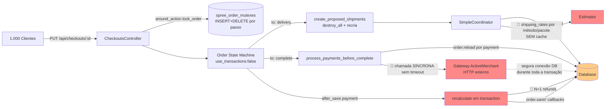

<!-- Gerado por /warroom-audit — Scalability Architect (opus) sobre Solidus @ 8d781ac. Evidência arquivo:linha real. -->

## 1. Resumo Executivo

Analisei o módulo de pedidos/checkout do Solidus `4.8.0.dev` (Rails `>= 7.2`) no código-fonte real, focando em `order.rb`, `order_updater.rb`, `in_memory_order_updater.rb`, `order_inventory.rb`, o coordenador de estoque/estimador de frete, o lock de concorrência (`order_mutex.rb`) e os controllers de API/backend.

**Veredito geral: 🔴 Crítico para escala transacional.** O fluxo de checkout não foi desenhado para alta concorrência por uma razão estrutural única e dominante: **cada passo de checkout segura uma conexão de banco em transação aberta enquanto executa trabalho caro e síncrono** — chamada ao gateway de pagamento via ActiveMerchant (sem timeout nesta camada), recriação completa de shipments e cálculo de frete sem cache, e recálculos O(n) disparados por callbacks. O ponto de ruptura sob carga **não é CPU nem memória — é o pool de conexões do banco**, que esvazia muito antes do throughput de API saturar.

Agravantes secundários: três padrões N+1 confirmados (refunds em `payment_total`, shipments em `determine_target_shipment`, stock_locations no `Quantifier`), ausência total de camada de cache em todo o caminho de estoque/frete (`grep` por `Rails.cache`/`Spree::Config.cache` nesses modelos retorna vazio), e write-amplification na tabela de mutex a cada transição.

Ressalva honesta: este é o **repositório do engine (gem)**, não um app deployado. Não há `puma.rb` nem `database.yml` de produção (o único `database.yml` é o `dummy_app` de teste). Portanto **não posso citar um `pool:` numérico de evidência** — os números de pool abaixo são parametrizados (assumo o default Rails de `5` por processo) e o leitor deve substituir pela config real do app que monta o Solidus.

---

## 2. Mapa de Fluxo de Dados com Gargalos

O "cano estreito" é a borda `Gateway -.-> Database`: a conexão de banco fica retida (transação aberta + objeto carregado) durante uma chamada HTTP externa de latência imprevisível. Com 1.000 checkouts simultâneos atingindo o passo `complete`, o número de conexões demandadas iguala o número de gateways em voo — e estoura o pool muito antes de qualquer limite de CPU.

---

## 3. Inventário de Gargalos

| # | Gargalo | Localização (arquivo:linha) | Limite Atual | Ponto de Ruptura (estimado) | Severidade |
|---|---|---|---|---|---|
| SCAL-001 | Conexão DB retida durante chamada síncrona ao gateway | `order/payments.rb:44-46` + `payment/processing.rb:37,53` | pool default Rails = 5/processo | ~5×N_processos checkouts concorrentes em `complete` | Crítico (9) |
| SCAL-002 | N+1 em `recalculate_payment_total` (refunds) | `order_updater.rb:151` / `in_memory_order_updater.rb:211` | 1 query/payment refunded | O(n_payments) por recálculo | Alto (7) |
| SCAL-003 | Recálculo O(n) disparado por `after_save` de cada payment | `order_updater.rb:19-33`, `payment.rb` after_save | 1 recalc completo/payment | n payments ⇒ n recalcs em transação | Alto (7) |
| SCAL-004 | `create_proposed_shipments` destrói e recria todos shipments + frete sem cache a cada `delivery` | `order.rb:510-511`, `simple_coordinator.rb:72,77-79`, `estimator.rb:38-39` | recompute total a cada visita ao step | latência cresce com métodos×pacotes×locations | Alto (7) |
| SCAL-005 | N+1 em `determine_target_shipment` (shipments + Quantifier) | `order_inventory.rb:60-70` | 1+ query/shipment | O(shipments) por line item verificado | Médio (6) |
| SCAL-006 | N+1 em `Quantifier#variant_stock_items` (stock_location por stock_item) | `quantifier.rb` (`variant_stock_items` / `total_on_hand`) | 1 query/stock_item | O(stock_locations) por consulta de estoque | Médio (6) |
| SCAL-007 | Write-amplification + 409 sob contenção no OrderMutex | `order_mutex.rb:19,22,31` | INSERT+DELETE por passo, sem retry | rajada de HTTP 409 + carga de escrita | Médio (6) |
| SCAL-008 | `order.reload` forçado antes de cada transação de gateway | `payment/processing.rb:116` | 1 SELECT completo/payment | O(n_payments) reloads no caminho crítico | Médio (5) |
| SCAL-009 | Ausência total de cache em estoque/frete | `grep Rails.cache` nos modelos = vazio | tudo recomputado | escala linear com tráfego de leitura | Médio (5) |
| SCAL-010 | Backend index com `ransack` sobre atributos arbitrários | `backend/admin/orders_controller.rb:53-56` | filtro/sort em colunas possivelmente sem índice | full scan sob carga admin | Médio (5) |
| SCAL-011 | `finalize` faz N writes de adjustments + shipments em uma transição sem rollback | `order.rb:760,764-770` | N updates/finalize | contenção de linha em pedidos grandes | Baixo (4) |

---

## 4. Análise Detalhada por Gargalo

### SCAL-001 — Conexão de banco retida durante o gateway (o gargalo dominante)
- **O que acontece:** Na transição `confirm → complete`, `process_payments_before_complete` (`order.rb:738`) chama `process_payments!` que itera `unprocessed_payments.each` (`order/payments.rb:44`) e executa `payment.process!` → `authorize!`/`purchase!` via ActiveMerchant (`payment/processing.rb:37,53`). Essa é uma chamada **HTTP externa síncrona**, feita dentro do request web, com a conexão de banco ainda associada ao processo (e, no caminho de `recalculate`, dentro de uma `order.transaction`).
- **Por que é um problema em escala:** O recurso retido (conexão DB) tem vida igual à latência do gateway, não à latência da query. Se o gateway responde em 800 ms (p50 típico) e o app roda com pool default de 5 conexões/processo, **cada processo só sustenta 5 checkouts simultâneos no passo de pagamento**. Não encontrei timeout configurado nesta camada — uma degradação do gateway (p99 de 10 s) multiplica o tempo de retenção e colapsa o pool.
- **Evidência:** `core/app/models/spree/order/payments.rb:44-46`; `core/app/models/spree/payment/processing.rb:37,53`.
- **Efeito cascata:** Pool esgotado → `ActiveRecord::ConnectionTimeoutError` em **todas** as requests do app (não só checkout: listagem de produto, login, tudo compartilha o pool) → fila no web server → timeouts em cascata.
- **Recomendação (ROI alto):** Não dá para mover o gateway para fora do request sem mudar UX, mas dá para (a) **liberar a conexão durante a I/O externa** isolando o `recalculate`/persistência fora da janela do gateway, e (b) **impor timeout explícito** no client ActiveMerchant. Quick win de config: `allow_checkout_on_gateway_error` já existe (regra de negócio #11 do Recon) — combine com circuit breaker.

### SCAL-002 — N+1 em `recalculate_payment_total`
- **Evidência:** `order_updater.rb:151` e `in_memory_order_updater.rb:211`:
  `order.payment_total = payments.completed.includes(:refunds).sum { |payment| payment.amount - payment.refunds.sum(:amount) }`
- **O problema:** o `includes(:refunds)` carrega refunds em memória, mas `payment.refunds.sum(:amount)` dentro do bloco é um `sum` **SQL** sobre a associação — ignora o eager-load e dispara uma query por payment. Já apontado como dívida no Recon (#4); aqui confirmo que está **duplicado** nos dois recalculadores. Como `recalculate` roda dentro de transação (`order_updater.rb:20`), essas N queries prolongam a retenção de conexão do SCAL-001.
- **Correção:** trocar por `payment.refunds.sum(&:amount)` (Ruby `Enumerable`, usa o eager-load) ou `payment.refund_total`. Esforço trivial, impacto direto na latência do passo `complete`.

### SCAL-003 — Recálculo O(n) por callback de payment
- **Evidência:** `OrderUpdater#recalculate` (`order_updater.rb:19-33`) é disparado por `after_save` em `Payment` (mapeado no Recon, `payment.rb`). `add_store_credit_payments` (`order.rb:585-625`) cria/atualiza múltiplos payments em sequência (`payments.create!` no loop `order.rb:609`, `invalidate!` em `order.rb:589,620`).
- **O problema:** cada save de payment dispara um `recalculate` completo — que reabre transação, refaz `update_totals`, refaz `update_adjustment_total` → `update_promotions` + `update_tax_adjustments` (instancia adjusters, `order_updater.rb:218-223`) e `persist_totals` → `order.save!`. Com créditos de loja múltiplos isso é O(n) recálculos completos, cada um com seu N+1 do SCAL-002 aninhado. Custo combinatório.
- **Correção:** batch — recalcular **uma vez** ao fim da construção de payments, em vez de por save. O `InMemoryOrderUpdater` com `persist: false` (`in_memory_order_updater.rb:26`) é exatamente o mecanismo para isso, mas o caminho de payment ainda força persistência.

### SCAL-004 — Recriação de shipments + frete sem cache a cada `delivery`
- **Evidência:** `order.rb:510-511` (`shipments.destroy_all; shipments.push(*coordinator.shipments)`); `simple_coordinator.rb:72` (`Spree::StockLocation.all`); `simple_coordinator.rb:77-79` + `estimator.rb:38-39` (`shipping_methods(package).map { |m| m.calculator.compute(package) }`).
- **O problema:** toda visita ao step `delivery` **apaga e reconstrói** todos os shipments, recarrega **todas** as stock locations e recomputa o frete rodando o calculator de cada shipping method para cada pacote. Nada disso é cacheado (`grep` confirma ausência). Em catálogos com muitas locations/métodos, é trabalho pesado repetido a cada idlinha-e-volta do cliente no checkout. Custo ≈ O(locations × métodos × pacotes) por transição.
- **Efeito em escala:** 1.000 clientes oscilando entre address↔delivery geram milhares de recomputações idênticas de frete/estoque contra o DB.
- **Correção:** cache de availability/shipping-rates por (variant-set, zona) com TTL curto; evitar `destroy_all` quando o endereço/itens não mudaram.

### SCAL-005 / SCAL-006 — N+1 em estoque
- **Evidência SCAL-005:** `order_inventory.rb:60` carrega `order.shipments.order(:created_at, :id)` e os `detect`s subsequentes (`:62,65,68`) chamam `shipment.include?(variant)` e instanciam `Quantifier.new(variant, shipment.stock_location).can_supply?` por shipment.
- **Evidência SCAL-006:** `Quantifier#variant_stock_items` itera `variant.stock_items.select { |si| ... si.stock_location.active? }` e `total_on_hand` faz `stock_items.sum(&:count_on_hand)` em memória — uma query de `stock_location` por `stock_item` sem `includes`.
- **O problema:** o custo de verificar inventário cresce com (shipments × stock_items × stock_locations). Já sinalizado parcialmente no Recon (Read Dependencies, `order_inventory.rb:60`); aqui confirmo o N+1 encadeado no Quantifier.
- **Correção:** `includes(:stock_location)` em `variant.stock_items`; pré-carregar `order.shipments` com locations.

### SCAL-007 — Mutex: write-amplification e 409 sob contenção
- **Evidência:** `order_mutex.rb:19` (`expired.where(order:).delete_all`), `:22` (`create!`), `:31` (`order_mutex&.destroy`).
- **O problema:** **cada** passo de checkout faz `DELETE` + `INSERT` + `DELETE` na `spree_order_mutexes`. Sob carga, isso é carga de escrita pura proporcional ao número de transições, não às vendas. E como `with_lock!` levanta `LockFailed` (→ HTTP 409) imediatamente sem retry (`order_mutex.rb:23-27`), dois requests concorrentes no mesmo pedido (ex.: double-click, retry de cliente, polling do front) geram 409s em vez de serialização graciosa. Não é contenção entre pedidos diferentes (índice é por `order_id`), então não é o gargalo nº1, mas adiciona escrita e ruído de erro em escala.
- **Correção:** o índice único já existe e é correto; considerar retry com backoff curto no client em vez de propagar 409.

### SCAL-008 — `order.reload` por transação de gateway
- **Evidência:** `payment/processing.rb:116` (`order.reload` dentro de `gateway_options`).
- **O problema:** cada `process!` recarrega o pedido inteiro do banco antes de falar com o gateway. Em pedido com múltiplos payments, são N SELECTs completos no caminho mais crítico (o de SCAL-001), aumentando ainda mais o tempo de retenção de conexão.

### SCAL-010 — Backend index com ransack irrestrito
- **Evidência:** `backend/admin/orders_controller.rb:53` (`ransack(params[:q])`), `:54-56` (`includes([:user]).page.per`).
- **O problema:** o admin permite filtrar/ordenar por atributos arbitrários expostos via ransack. Filtros/sorts em colunas sem índice viram full scan; sob uso simultâneo de operadores admin em uma base grande de pedidos, isso compete pelo mesmo pool do checkout. O `includes([:user])` evita N+1 do usuário, mas não protege contra scan no `WHERE`/`ORDER BY`.

---

## 5. Simulação de Carga (1.000 Checkouts Simultâneos no Passo de Pagamento)

Premissas (parametrizadas — substitua pela config real do app deployado): pool Rails default `5` conexões/processo; latência gateway p50 = 800 ms; sem timeout configurado nesta camada (não encontrado no código).

| Recurso | Demanda Estimada | Capacidade Atual | Status |
|---|---|---|---|
| Conexões DB (passo `complete`) | ~1.000 (1 retida/checkout durante o gateway) | 5 × N_processos | 🔴 estoura com poucas dezenas de processos |
| Queries por checkout (N+1 SCAL-002/005/006) | dezenas extras/pedido | — | 🔴 amplifica retenção de conexão |
| Escrita em `spree_order_mutexes` | ~(passos × 2) ops/pedido | — | 🟡 carga de escrita evitável |
| Recomputação de frete/estoque (sem cache) | recomputado a cada visita a delivery | 0 cache hits | 🟡 desperdício linear |
| Memória | sem upload/streaming de arquivos no escopo | — | 🟢 não é o gargalo |
| Throughput de API (CPU) | — | — | 🟢 satura depois do pool |

Conclusão da simulação: **o sistema falha por esgotamento de pool de conexões durante a janela do gateway**, não por CPU nem memória. Memória não é risco neste escopo (não há processamento in-memory de arquivos grandes no caminho de checkout). O ponto de ruptura é função direta de `pool_size × n_processos ÷ latência_do_gateway`.

---

## 6. Plano de Ação para Escalar

| Prioridade | Ação | Esforço | Impacto | Refs |
|---|---|---|---|---|
| P0 | Impor **timeout explícito** no client ActiveMerchant + circuit breaker; combinar com `allow_checkout_on_gateway_error` | Baixo (config) | Alto — evita colapso do pool por gateway lento | SCAL-001 |
| P0 | Corrigir N+1 de refunds: `payment.refunds.sum(&:amount)` (Ruby) nos dois recalculadores | Trivial | Alto — encurta transação no `complete` | SCAL-002 |
| P0 | Dimensionar `pool:` do `database.yml` de produção ≥ threads do web server (não existe no repo do engine — responsabilidade do app) | Baixo | Alto | SCAL-001 |
| P1 | Liberar conexão DB durante a I/O do gateway (não manter transação aberta sobre HTTP externo) | Médio | Alto | SCAL-001/008 |
| P1 | Batch de recálculo: recalcular uma vez ao fim da construção de payments (usar `persist:false`) | Médio | Alto | SCAL-003 |
| P1 | Cache de availability/shipping-rates com TTL curto; evitar `destroy_all` de shipments quando endereço/itens inalterados | Médio | Alto | SCAL-004/009 |
| P2 | `includes(:stock_location)` em stock_items; pré-carregar shipments+locations no `OrderInventory` | Baixo | Médio | SCAL-005/006 |
| P2 | Remover `order.reload` redundante por payment no `gateway_options` | Baixo | Médio | SCAL-008 |
| P2 | Whitelist de atributos ransackáveis no admin + índices nas colunas filtráveis/ordenáveis | Médio | Médio | SCAL-010 |
| P2 | Retry com backoff no client em vez de propagar HTTP 409 do mutex | Baixo | Baixo | SCAL-007 |

---

## Achados (estruturado)

| ID | Título | Severidade(1-10) | Categoria | Arquivo:Linha | Impacto de negócio | Risco técnico |
|---|---|---|---|---|---|---|
| SCAL-001 | Conexão DB retida durante chamada síncrona ao gateway, sem timeout | 9 | Pool de conexões / Latência externa | `core/app/models/spree/order/payments.rb:44-46`; `core/app/models/spree/payment/processing.rb:37,53` | Queda total do site (todas as rotas) quando o gateway degrada; perda de vendas em pico | Esgotamento do pool de conexões; `ConnectionTimeoutError` em cascata |
| SCAL-002 | N+1 em `recalculate_payment_total` (refunds) | 7 | N+1 query | `core/app/models/spree/order_updater.rb:151`; `core/app/models/spree/in_memory_order_updater.rb:211` | Latência elevada no fechamento do pedido | N queries por recálculo dentro de transação; amplia SCAL-001 |
| SCAL-003 | Recálculo completo O(n) disparado por `after_save` de cada payment | 7 | Callback cascata | `core/app/models/spree/order_updater.rb:19-33`; `core/app/models/spree/order.rb:585-625` | Checkout lento com múltiplos pagamentos/créditos | Recálculos combinatórios em transações aninhadas |
| SCAL-004 | Shipments recriados + frete recomputado sem cache a cada `delivery` | 7 | Falta de cache / Trabalho repetido | `core/app/models/spree/order.rb:510-511`; `core/app/models/spree/stock/simple_coordinator.rb:72,77-79`; `core/app/models/spree/stock/estimator.rb:38-39` | Lentidão no passo de entrega; abandono de carrinho | Carga repetida de DB e cálculo proporcional a locations×métodos×pacotes |
| SCAL-005 | N+1 em `determine_target_shipment` (shipments + Quantifier) | 6 | N+1 query | `core/app/models/spree/order_inventory.rb:60-70` | Lentidão ao ajustar itens em pedidos completos | Queries proporcionais ao nº de shipments |
| SCAL-006 | N+1 em `Quantifier#variant_stock_items` (stock_location por stock_item) | 6 | N+1 query | `core/app/models/spree/stock/quantifier.rb` (`variant_stock_items`/`total_on_hand`) | Latência em verificações de estoque sob multi-location | Query de stock_location por stock_item, sem `includes` |
| SCAL-007 | Write-amplification e HTTP 409 sob contenção no OrderMutex | 6 | Concorrência / Carga de escrita | `core/app/models/spree/order_mutex.rb:19,22,31` | Erros 409 visíveis ao usuário em double-click/retry | INSERT+DELETE por transição; sem retry gracioso |
| SCAL-008 | `order.reload` forçado antes de cada transação de gateway | 5 | Query redundante | `core/app/models/spree/payment/processing.rb:116` | Fechamento mais lento com múltiplos pagamentos | SELECT completo por payment no caminho crítico |
| SCAL-009 | Ausência total de camada de cache em estoque/frete | 5 | Falta de cache | `core/app/models/spree/order_*`, `stock_*` (grep `Rails.cache` = vazio) | Custo de infra cresce linearmente com tráfego | Sem mitigação para cache stampede em dados quentes |
| SCAL-010 | Backend index com ransack sobre atributos arbitrários | 5 | Query sem índice | `backend/app/controllers/spree/admin/orders_controller.rb:53-56` | Painel admin lento/instável em base grande | Full scan em colunas sem índice competindo pelo pool |
| SCAL-011 | `finalize` faz N writes de adjustments/shipments numa transição sem rollback | 4 | Acoplamento / Contenção | `core/app/models/spree/order.rb:760,764-770` | Risco de estado inconsistente em pedidos grandes | Múltiplos UPDATEs e contenção de linha em `spree_orders` |

> Nota de escopo: este é o repositório do **engine** Solidus; não há `puma.rb` nem `database.yml` de produção (apenas o `dummy_app` de teste em `core/lib/spree/testing_support/dummy_app/database.yml`). Os limites numéricos de pool/timeout na Seção 5 são parametrizados e devem ser confirmados contra a configuração do aplicativo que monta o Solidus. Todas as afirmações sobre comportamento de código têm evidência `arquivo:linha` verificada no código real.
