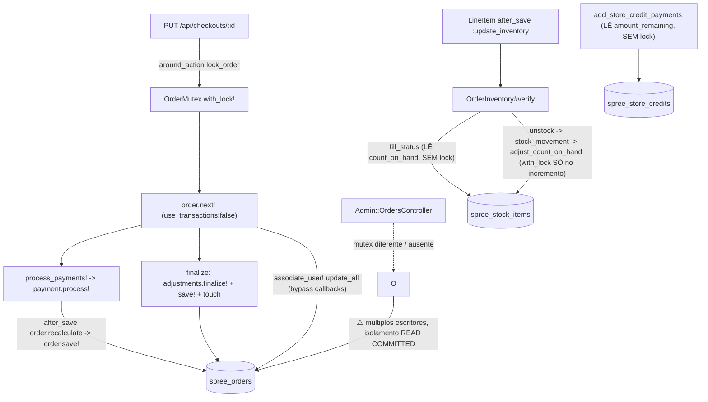

<!-- Gerado por /warroom-audit — Concurrency Specialist (opus) sobre Solidus @ 8d781ac. Evidência arquivo:linha real. -->

## 1. Resumo de Risco de Concorrência

**Veredito: 🔴 RISCO GLOBAL ALTO.** O módulo de pedidos/checkout do Solidus delega *toda* a exclusão mútua a uma tabela-mutex de nível de aplicação (`spree_order_mutexes`) e **abre mão de transações na state machine** (`use_transactions: false`). Não há um único `SELECT ... FOR UPDATE` sobre a linha do pedido em todo o fluxo de checkout — a integridade depende de um lock cooperativo que (a) não é reentrante, (b) tem uma janela de expiração que permite duas seções críticas concorrentes, e (c) é contornado por caminhos administrativos. O estoque é decrementado num padrão clássico **check-then-act** sem lock abrangente, permitindo *oversell*.

Confirmei **as 3 pistas do Recon** com evidência e **adicionei 9 achados novos**. Total: **12 achados** (2 críticos, 5 altos, 5 médios). Os mais graves: `CONC-001` (state inconsistente sem rollback), `CONC-002` (oversell por TOCTOU de estoque), `CONC-005` (double-spend de store credit) e `CONC-006` (risco de cobrança dupla / perda de mudanças em memória no gateway).

---

## 2. Mapa de Pontos de Escrita



---

## 3. Análise de Race Conditions

| # | Cenário | Caminhos Envolvidos | Registro Afetado | Risco | Evidência |
|----|---------|----------------------|------------------|-------|-----------|
| 1 | Transição de estado falha no meio sem rollback | `next!` / `complete!` | `spree_orders` + adjustments/shipments | 🔴 Crítico | `state_machines/order/class_methods.rb:38`; `order.rb:758-774` |
| 2 | Oversell: dois checkouts leem o mesmo `count_on_hand` e ambos decrementam | `OrderInventory#verify` → `unstock` | `spree_stock_items` | 🔴 Crítico | `order_inventory.rb:23-24,76,86`; `stock_item.rb:37-44`; `inventory_units_finalizer.rb:18-21,35-41` |
| 3 | Janela de expiração do mutex permite 2 seções críticas | `OrderMutex.with_lock!` | `spree_order_mutexes` | 🟡 Alto | `order_mutex.rb:9,19-22,31` |
| 4 | Double-spend de store credit | `add_store_credit_payments` | `spree_store_credits` / `spree_payments` | 🟡 Alto | `order.rb:594-610` |
| 5 | Cobrança dupla / perda de mudanças em memória no gateway | `process_payments!` + `gateway_options` | gateway externo + `spree_payments` | 🟡 Alto | `order/payments.rb:40-48`; `payment/processing.rb:116` |
| 6 | Lost update nos totais do pedido em recálculos concorrentes | `recalculate` (read-modify-write em Ruby) | `spree_orders` | 🟡 Alto | `order_updater.rb:19-33,150-199`; `in_memory_order_updater.rb:34-57` |
| 7 | Números de pedido duplicados (TOCTOU + índice não-único) | `NumberGenerator#generate` | `spree_orders.number` | 🟡 Médio | `order/number_generator.rb:32-42`; migration `:309` |
| 8 | Promoções duplicadas em conclusões concorrentes | `ensure_promotions_eligible` | adjustments | 🟡 Médio | `order.rb:808-817` |

### Detalhamento do Cenário #1 — `use_transactions: false` (confirma Mina #1 do Recon)

A state machine é declarada com transações desabilitadas (`class_methods.rb:38`). O callback `after_transition to: :complete, do: :finalize` (`class_methods.rb:103`) executa **escritas em múltiplas tabelas sem transação envolvente**:

```ruby
# order.rb:758-774
def finalize
  all_adjustments.each(&:finalize!)        # 1. ESCREVE N adjustments (state=closed)
  recalculator.recalculate_payment_state   # 2. muta order em memória
  shipments.each do |shipment|
    shipment.update_state                  # 3. ESCREVE shipments
    shipment.finalize!                     # 4. ESCREVE inventory (unstock!)
  end
  recalculator.recalculate_shipment_state
  save!                                    # 5. ESCREVE order  <-- se falhar aqui...
  touch :completed_at                      # 6. ESCREVE order de novo
end
```

```
T1: finalize -> adjustments TODOS travados (closed) -> shipments.finalize! -> UNSTOCK feito
T1:                                                                          -> save! LEVANTA (ex: validação de stock < 0, deadlock, timeout)
Resultado: adjustments travados + estoque decrementado, mas order continua em :confirm,
           sem completed_at, sem payment processado de forma consistente. SEM ROLLBACK.
```

**Causa raiz:** `use_transactions: false` desativa o `transaction do ... end` que a gem `state_machines-activerecord` envolveria em torno da transição. As sub-operações têm transações próprias e isoladas (`InventoryUnit.transaction` em `inventory_units_finalizer.rb:18`), então um commit parcial não é desfeito quando uma etapa posterior falha.

### Detalhamento do Cenário #2 — TOCTOU de estoque / Oversell (confirma e aprofunda Mina #3 do Recon)

O Recon disse que `verify` lê `inventory_units.count`. O problema **real e mais grave** está no decremento de estoque. A sequência de leitura e escrita de `count_on_hand` **não compartilha o mesmo lock**:

```ruby
# order_inventory.rb:76  -> LÊ disponibilidade SEM lock
on_hand, back_order = shipment.stock_location.fill_status(variant, quantity)
#   fill_status (stock_location.rb:109-115 -> stock_item.rb:74-85) só lê count_on_hand

# order_inventory.rb:86  -> DEPOIS, decrementa
Spree::Stock::InventoryUnitsFinalizer.new(pending_units).run!
#   -> unstock (stock_location.rb:97) -> stock_movement.create!
#   -> adjust_count_on_hand (stock_item.rb:37-44) -> with_lock { count_on_hand += value; save! }
```

O `with_lock` em `stock_item.rb:38` só torna **atômico o incremento aritmético**, não o intervalo entre a decisão (`fill_status`) e o decremento:

```
StockItem count_on_hand = 1
T1: fill_status(qty=1) -> on_hand=1, backorder=0   (decide: tem estoque)
T2: fill_status(qty=1) -> on_hand=1, backorder=0   (decide: tem estoque)  <-- ambos viram 1
T1: adjust_count_on_hand(-1) -> with_lock -> count = 0   (OK)
T2: adjust_count_on_hand(-1) -> with_lock -> count = -1  <-- OVERSELL
```

Pior: a validação `count_on_hand >= 0 unless backorderable?` (`stock_item.rb:13`) faz o `save!` de T2 **levantar exceção dentro de `finalize`**, recaindo no Cenário #1 (estado inconsistente). Variantes backorderable simplesmente vendem estoque inexistente silenciosamente.

### Detalhamento do Cenário #3 — Janela de expiração do mutex (refina Mina #2 do Recon)

O Recon afirmou que "dois processos podem deletar e ambos criar com sucesso". **Corrijo com evidência:** o índice único `index_spree_order_mutexes_on_order_id unique: true` (migration `:266`) garante que de dois `create!` simultâneos **apenas um vence** — o outro recebe `RecordNotUnique` → `LockFailed` (`order_mutex.rb:22-27`). A pista do Recon nesse ponto é **mitigada**.

O risco **real** é outro: o `expired.where(order:).delete_all` (`order_mutex.rb:19`) deleta o lock de um processo **ainda ativo** que ultrapassou `order_mutex_max_age` (120s, `app_configuration.rb`):

```
T1: with_lock! adquire às 00:00, executa operação LENTA (>120s)
T2: with_lock! às 02:05 -> expired.delete_all REMOVE a linha de T1 -> create! sucesso
    >>> AGORA T1 e T2 executam a seção crítica EM PARALELO (mutex não é mais mútuo) <<<
T1: termina -> ensure { order_mutex&.destroy } -> destrói linha já deletada (no-op)
```

Duas conclusões de checkout/cancelamento concorrentes sobre o mesmo pedido → reaplicação de pagamentos, dupla expedição, etc.

### Detalhamento do Cenário #4 — Double-spend de Store Credit (novo)

`add_store_credit_payments` (`order.rb:594-610`) lê o saldo do crédito e cria o pagamento **sem lock sobre o store credit**:

```ruby
authorized_total = payments.pending.sum(:amount)          # order.rb:594  LÊ
remaining_total  = outstanding_balance - authorized_total  # order.rb:596
matching_store_credits = user.store_credits.where(currency:) # order.rb:598  LÊ saldo
sorter.call.each do |credit|
  amount_to_take = [credit.amount_remaining, remaining_total].min # order.rb:608  LÊ amount_remaining
  payments.create!(source: credit, amount: amount_to_take, ...)   # order.rb:609  ESCREVE
```

Dois pedidos do mesmo usuário (carrinhos distintos → mutexes de `order_id` distintos, então o `OrderMutex` **não protege**) chegando a `:confirm` simultaneamente leem o mesmo `amount_remaining` e ambos consomem o crédito → gasto duplicado do saldo.

---

## 4. Análise de Transações

Nenhum `isolation:` é configurado em nenhum dos `transaction do` — todos rodam no **default do banco (READ COMMITTED em Postgres/MySQL)**, insuficiente para os read-modify-write em Ruby.

| Operação | Nível Atual | Nível/Mecanismo Recomendado | Transação? | Observação |
|----------|-------------|------------------------------|------------|------------|
| Transição de estado (`next!`/`complete!`) | **Nenhuma** (`use_transactions:false`) | `REQUIRED` + lock pessimista na order | ❌ | `class_methods.rb:38` |
| `finalize` (multi-write) | Herda (nenhuma) | Mesma transação da transição | ❌ | `order.rb:758-774` |
| `OrderUpdater#recalculate` | READ COMMITTED | `SELECT FOR UPDATE` na order | ✅ `order_updater.rb:20` | read-modify-write não atômico (`:150-199`) |
| `InMemoryOrderUpdater#recalculate` | READ COMMITTED | idem | ✅ `in_memory_order_updater.rb:34` | idem |
| `adjust_count_on_hand` | READ COMMITTED + `with_lock` | manter, mas estender lock ao `fill_status` | ✅ (row lock) | `stock_item.rb:38` — lock bom, mas escopo curto |
| `InventoryUnitsFinalizer#run!` | READ COMMITTED | unificar com a transação da transição | ✅ isolada | `inventory_units_finalizer.rb:18` — transação *separada* agrava #1 |
| `associate_user!` | nenhuma (`update_all`) | optimistic lock (`lock_version`) | ❌ bypass | `order.rb:331` |
| `restart_checkout_flow` | nenhuma (`update_columns`) | dentro de transação + tratamento de falha do `self.next` | ❌ bypass | `order.rb:528,539-543` |

---

## 5. Análise de Deadlocks

| # | Cenário | Tabelas Envolvidas | Ordem de Lock | Risco |
|----|---------|--------------------|---------------|-------|
| 1 | `finalize` trava adjustments→shipments→inventory_units→order, enquanto `recalculate` (disparado por `payment after_save`) trava order→shipments | `spree_orders`, `spree_shipments`, `spree_adjustments`, `spree_inventory_units` | order→shipments vs shipments→order | 🟡 Médio — `order.rb:760-770` vs `order_updater.rb:142-147` |
| 2 | Mutex não reentrante causa `LockFailed`, não deadlock clássico, mas trava lógica equivalente (ver CONC-004) | `spree_order_mutexes` | — | 🟡 Médio — `order_mutex.rb:15-32` |
| 3 | `with_lock` por `StockItem` em ordem de iteração de variantes não-determinística entre dois pedidos multi-item | `spree_stock_items` | variante A→B vs B→A | 🟡 Médio — `order_inventory.rb:76,86` |

O cenário #3 é real: dois pedidos contendo as variantes A e B em ordens diferentes podem adquirir row locks de `stock_items` em ordem cruzada durante `adjust_count_on_hand` (`stock_item.rb:38`), gerando deadlock no banco.

---

## 6. Recomendações de Locking

| Problema | Estratégia Recomendada | Justificativa |
|----------|------------------------|---------------|
| Estoque (CONC-002) | **Pessimistic**: estender o `with_lock` para envolver `fill_status` + `unstock` numa única seção crítica, ou usar `UPDATE ... SET count = count - q WHERE count >= q` (decremento condicional atômico) | Conflito frequente em produtos populares; oversell é inaceitável |
| Totais do pedido (CONC-007) | **Optimistic**: adicionar `lock_version` (coluna ActiveRecord) à `spree_orders`; `recalculate` re-tenta em `StaleObjectError` | Conflito raro, mas lost update de total = cobrança errada |
| State machine (CONC-001) | Reativar `use_transactions: true` **ou** envolver `next!`/`finalize` em `order.with_lock { ... }` (pessimista) | Atomicidade do checkout é mandatória |
| Mutex de pedido (CONC-003/CONC-004) | Substituir tabela-mutex por `SELECT FOR UPDATE` (`order.with_lock`) com transação, naturalmente reentrante e sem janela de expiração | Elimina expiração órfã e não-reentrância de uma vez |
| Store credit (CONC-005) | **Pessimistic**: `store_credit.with_lock` ao validar/debitar saldo | Dinheiro: double-spend inaceitável |
| Número do pedido (CONC-008) | Adicionar `unique: true` ao índice `spree_orders.number` + `retry` no `RecordNotUnique` | Backstop de banco; o `exists?` sozinho é TOCTOU |

### Implementação Sugerida (decremento atômico de estoque — CONC-002)

```ruby
# Substituir o par fill_status/unstock por um decremento condicional atômico:
def claim_on_hand!(stock_item, quantity)
  updated = Spree::StockItem
    .where(id: stock_item.id)
    .where("count_on_hand >= ?", quantity)
    .update_all("count_on_hand = count_on_hand - #{quantity.to_i}")
  updated == 1 # false => sem estoque suficiente, tratar como backorder/erro
end
```

---

## 7. Checklist de Idempotência

| Operação | Idempotente? | Risco se Repetida | Correção |
|----------|--------------|-------------------|----------|
| `OrderMutex.with_lock!` | **Não (não-reentrante)** | `LockFailed` em chamada aninhada na mesma thread (`order_mutex.rb:22`) | Tornar reentrante (contador por thread) ou usar `order.with_lock` |
| `process_payments!` | **Não** | Cobrança dupla no gateway se chamado 2x (`order/payments.rb:40-48`) | Idempotency key no gateway + lock |
| `NumberGenerator#generate` | **Não** | Número duplicado (índice não-único, `migration:309`) | Índice único + retry |
| `finalize` | **Não** | Adjustments re-finalizados / re-touch (`order.rb:758`) | Guard por `completed_at.present?` |
| `add_store_credit_payments` | **Não** | Crédito debitado em duplicidade (`order.rb:609`) | Lock + checagem de pagamento existente |
| `OrderInventory#verify` | Parcial | Decremento duplo de estoque sob concorrência (`order_inventory.rb:86`) | Decremento condicional atômico |

---

## Achados (estruturado)

| ID | Título | Severidade (1-10) | Categoria | Arquivo:Linha | Impacto de negócio | Risco técnico |
|----|--------|-------------------|-----------|---------------|--------------------|---------------|
| CONC-001 | State machine sem transação deixa pedido inconsistente em falha parcial | 9 | Transação ausente | `core/app/models/spree/core/state_machines/order/class_methods.rb:38`; `core/app/models/spree/order.rb:758-774` | Pedidos "presos" entre estados, estoque decrementado sem pedido completo, conciliação manual | `use_transactions:false`; `finalize` escreve em 4+ tabelas com transações isoladas, sem rollback |
| CONC-002 | Oversell por TOCTOU de estoque (check `fill_status` ≠ decremento) | 9 | Race condition / TOCTOU | `core/app/models/spree/order_inventory.rb:76,86`; `core/app/models/spree/stock_item.rb:37-44`; `core/app/models/spree/stock/inventory_units_finalizer.rb:18,35-41` | Venda de estoque inexistente; ruptura, cancelamentos, perda de confiança | `with_lock` cobre só o incremento aritmético, não o intervalo decisão→escrita |
| CONC-003 | Janela de expiração do mutex permite 2 seções críticas concorrentes | 7 | Locking insuficiente | `core/app/models/spree/order_mutex.rb:9,19-22,31` | Dupla conclusão/cancelamento do mesmo pedido em operações >120s | `expired.delete_all` remove lock de processo ativo; índice único só evita create duplo, não a janela |
| CONC-004 | `OrderMutex.with_lock!` não é reentrante | 5 | Reentrância | `core/app/models/spree/order_mutex.rb:15-32` | Operações compostas (ex. cancel→reimburse) falham com `LockFailed` espúrio | `create!` aninhado na mesma thread colide com o índice único do próprio lock |
| CONC-005 | Store credit pode ser gasto em duplicidade | 7 | Race condition | `core/app/models/spree/order.rb:594-610` | Prejuízo financeiro direto (saldo debitado 2x entre carrinhos do mesmo usuário) | Lê `amount_remaining`/saldo e cria payment sem lock; mutexes de orders distintos não protegem |
| CONC-006 | Cobrança dupla e perda de mudanças em memória no processamento de pagamento | 7 | Race / Idempotência | `core/app/models/spree/order/payments.rb:40-48`; `core/app/models/spree/payment/processing.rb:116` | Cliente cobrado em duplicidade; estado de pagamento divergente | `process_payments!` sem idempotency key; `order.reload` em `gateway_options` descarta atributos não persistidos |
| CONC-007 | Lost update nos totais do pedido em recálculos concorrentes | 6 | Race condition | `core/app/models/spree/order_updater.rb:19-33,150-199`; `core/app/models/spree/in_memory_order_updater.rb:34-57` | Total/pagamento incorretos faturados ao cliente | Read-modify-write em Ruby sob READ COMMITTED, sem `lock_version` nem `FOR UPDATE` |
| CONC-008 | Número de pedido duplicado (TOCTOU + índice não-único) | 6 | TOCTOU | `core/app/models/spree/order/number_generator.rb:32-42`; `core/db/migrate/20160101010000_solidus_one_four.rb:309` | Dois pedidos com mesmo número → erros em fatura, suporte, integração fiscal | `exists?` seguido de save sem unique constraint de banco como backstop |
| CONC-009 | Deadlock potencial em locks de `stock_items` multi-variante | 5 | Deadlock | `core/app/models/spree/order_inventory.rb:76,86`; `core/app/models/spree/stock_item.rb:38` | Falhas intermitentes de checkout sob carga | Row locks adquiridos em ordem não-determinística (A→B vs B→A) entre pedidos |
| CONC-010 | Promoções duplicadas em conclusões concorrentes | 5 | Race condition | `core/app/models/spree/order.rb:808-817` | Desconto aplicado em dobro; perda de margem | `ensure_promotions_eligible` usa check `persist:false` + `promo_total_changed?` sem lock entre verificação e complete |
| CONC-011 | `restart_checkout_flow` com `update_column(s)` deixa pedido em estado parcial | 4 | Inconsistência de estado | `core/app/models/spree/order.rb:525-531,536-543` | Pedido travado em `cart` com `shipment_total` desatualizado se `self.next` falhar | `update_columns` ignora callbacks/validações; sem transação envolvendo o `self.next` |
| CONC-012 | `associate_user!` via `update_all` causa lost update e estado stale | 4 | Lost update | `core/app/models/spree/order.rb:323-335` | Atribuição de usuário/email sobrescreve edições concorrentes silenciosamente | `unscoped.update_all` bypassa callbacks, validações e `lock_version` |
