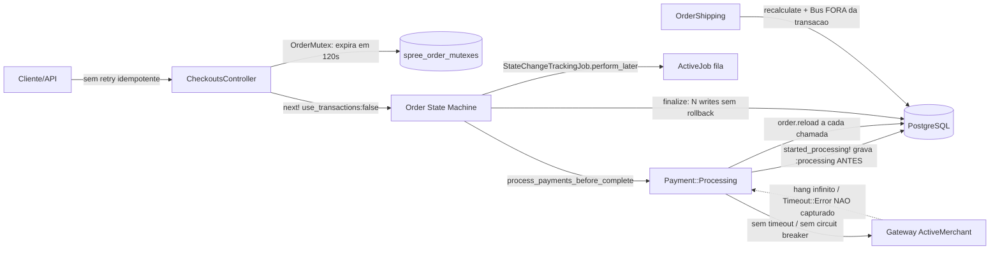

<!-- Gerado por /warroom-audit — Chaos Engineer/SRE (opus) sobre Solidus @ 8d781ac. Evidência arquivo:linha real. -->

## 1. Veredito de Resiliência

🔴 **Frágil.** O fluxo de pagamento/checkout do Solidus foi desenhado para o "caminho feliz" e para concorrência (mutex otimista), mas **não tem nenhuma defesa contra falhas de I/O do gateway**: zero timeouts, zero retries com backoff, zero circuit breaker (o único `retry_on` do projeto inteiro é `ActiveRecord::Deadlocked` em `core/app/jobs/spree/base_job.rb:7`). O tratamento de erro do gateway captura **apenas** `ActiveMerchant::ConnectionError` (`payment/processing.rb:212-216`) — timeouts de socket, resets de conexão e erros de SSL passam direto. Combinado com `use_transactions: false` na state machine e com o lock que **expira em 120s enquanto a request ainda está pendurada**, o sistema tem múltiplos caminhos para **cobrar o cliente e não completar o pedido** ou **cobrar duas vezes**.

**Pior cenário identificado:** Gateway pendura sem responder → a request fica presa indefinidamente (sem read-timeout) → o `OrderMutex` expira aos 120s → uma segunda request adquire o lock e reprocessa o mesmo pedido → **cliente é cobrado duas vezes** e/ou o pool de threads do Puma esgota e o site inteiro cai (não só o checkout).

---

## 2. Mapa de Superfície de Falha



---

## 3. Catálogo de Cenários de Desastre

### Cenário #1: Gateway pendura sem read-timeout → exaustão do pool de threads

| Atributo | Detalhe |
|---|---|
| **Gatilho** | Gateway ActiveMerchant aceita a conexão mas nunca responde (degradação, deploy do provedor, rede congestionada) |
| **Probabilidade** | **Alta** (provedores de pagamento têm incidentes regulares) |
| **Impacto** | Cada checkout prende uma thread Puma indefinidamente; site inteiro fica indisponível, não só o checkout |
| **Blast Radius** | 100% dos usuários (homepage, catálogo, admin — tudo que compartilha o pool) |
| **Evidência** | `payment/processing.rb:42-49` (sem timeout), `payment_method.rb:90-100` (`@gateway ||= gateway_class.new(gateway_options)` — nenhum `read_timeout`/`open_timeout` configurado) |

**Sequência de falha:**
1. **T+0s** — `authorize!`/`purchase!` chama o gateway dentro de `protect_from_connection_error`; a thread bloqueia no socket.
2. **T+30s** — sem read-timeout, a thread continua presa; novas requests de checkout chegam e prendem mais threads.
3. **T+5min** — o pool do Puma esgota; requests não relacionadas (catálogo, login) passam a dar 503. Cascata para o site inteiro.

**Comportamento atual do código:**
```ruby
# payment/processing.rb:42-49
protect_from_connection_error do
  response = payment_method.authorize(money.money.cents, source, gateway_options)
  pend! if handle_response(response)
end
# payment/processing.rb:212-216 — só captura ConnectionError, não Timeout::Error
def protect_from_connection_error
  yield
rescue ActiveMerchant::ConnectionError => error
  gateway_error(error)
end
```

**O que deveria existir:**
- [ ] `read_timeout` e `open_timeout` (ex.: 8s/3s) na construção do gateway
- [ ] Circuit Breaker com threshold (ex.: 5 falhas / 30s) por payment method
- [ ] Fallback: degradar para "pagamento pendente / tentamos depois" em vez de prender a thread
- [ ] Capturar `Timeout::Error`, `Net::ReadTimeout`, `Net::OpenTimeout`, `Errno::ECONNRESET`, `SocketError`, `OpenSSL::SSL::SSLError`

---

### Cenário #2: Lock expira aos 120s durante gateway pendurado → cobrança em dobro

| Atributo | Detalhe |
|---|---|
| **Gatilho** | Gateway demora > `order_mutex_max_age` (padrão 120s) e o cliente/retry/balanceador dispara uma segunda request |
| **Probabilidade** | **Média-Alta** (consequência direta do Cenário #1) |
| **Impacto** | Duas requests processam o mesmo pedido simultaneamente; o gateway recebe duas cobranças |
| **Blast Radius** | Por pedido, mas financeiramente crítico + chargeback/PCI |
| **Evidência** | `order_mutex.rb:9,19` (expiração + `delete_all` dos expirados), `app_configuration.rb:214` (`order_mutex_max_age` = 120s), `payment/processing.rb:42-49` (sem timeout que limite a request abaixo de 120s) |

**Sequência de falha:**
1. **T+0s** — Request A adquire o mutex e chama o gateway; pendura.
2. **T+120s** — O lock de A é considerado expirado; `delete_all` o remove.
3. **T+121s** — Request B (retry do usuário/load balancer) adquire o lock e executa `process_payments!` no mesmo pedido → segunda cobrança no gateway.

**O que deveria existir:**
- [ ] Timeout do gateway **estritamente menor** que `order_mutex_max_age`
- [ ] Idempotency key enviada ao gateway por tentativa de cobrança
- [ ] Lock heartbeat/renovação enquanto a operação está viva (não expirar lock de operação em andamento)

---

### Cenário #3: Pagamento órfão preso em `:processing` (gateway cobra, app não confirma)

| Atributo | Detalhe |
|---|---|
| **Gatilho** | Crash do processo / perda de conexão DB / timeout **após** o gateway capturar mas **antes** de `complete!`/`pend!` persistir |
| **Probabilidade** | **Média** |
| **Impacto** | Cliente cobrado; pagamento fica `:processing` para sempre; pedido nunca completa; **nenhum retry consegue corrigir** |
| **Blast Radius** | Por pedido; gera disputa/refund manual |
| **Evidência** | `payment/processing.rb:40,56` (`started_processing!` persiste `:processing` ANTES da chamada), `payment/processing.rb:168` (`check_payment_preconditions!` faz `return if processing?`), `processing.rb:25-35` (`process!` não faz nada para pagamento já em processing) |

**Sequência de falha:**
1. **T+0s** — `started_processing!` grava `state = :processing` no banco.
2. **T+2s** — Gateway captura o dinheiro com sucesso.
3. **T+2s** — Processo morre / DB cai antes de `complete!`. O pagamento fica `:processing` permanentemente.
4. **T+depois** — Qualquer reprocessamento chama `process!`/`check_payment_preconditions!`, que retorna cedo por `processing?` → **o pagamento nunca é reconciliado**. Dinheiro preso, pedido incompleto. Não existe job de reconciliação no código.

**O que deveria existir:**
- [ ] Job de reconciliação que consulta o gateway por pagamentos presos em `:processing` há > N minutos
- [ ] Idempotency key para permitir reconsulta segura do status real da transação
- [ ] Registrar a referência da transação antes da chamada para permitir `verify`/`inquire`

---

### Cenário #4: `use_transactions: false` + `finalize` multi-tabela → pedido completo sem consistência

| Atributo | Detalhe |
|---|---|
| **Gatilho** | Falha de DB (CPU 100%, deadlock, conexão perdida) no meio de `finalize`, **após** o pagamento já ter sido capturado |
| **Probabilidade** | **Média** (picos de Black Friday → DB saturado) |
| **Impacto** | Adjustments finalizados mas pedido não salvo; ou `completed_at` não tocado; estado financeiro inconsistente com dinheiro já cobrado |
| **Blast Radius** | Por pedido, em massa durante incidente de DB |
| **Evidência** | `core/state_machines/order/class_methods.rb:38` (`use_transactions: false`), `order.rb:758-775` (`all_adjustments.each(&:finalize!)` → `recalculate_payment_state` → `shipments.each(&:finalize!)` → `save!` → `touch :completed_at`, várias escritas sem transação envolvente) |

**Sequência de falha:**
1. **T+0s** — `process_payments!` cobra o cliente com sucesso (`order.rb:746`).
2. **T+0.1s** — `finalize` executa `all_adjustments.each(&:finalize!)` (escreve).
3. **T+0.2s** — `save!` (linha 770) falha por deadlock/conexão. Sem `use_transactions`, **não há rollback**: adjustments travados, pagamento capturado, pedido não-completo. Estado órfão financeiramente positivo (dinheiro recebido, pedido "perdido").

**O que deveria existir:**
- [ ] Envolver `finalize` em transação explícita OU tornar cada passo idempotente e retomável
- [ ] Outbox pattern para `order_finalized` (hoje publicado em `order.rb:774` sem garantia transacional)

---

### Cenário #5: `allow_checkout_on_gateway_error` → pedido completo SEM pagamento

| Atributo | Detalhe |
|---|---|
| **Gatilho** | `GatewayError` levantado e `Spree::Config[:allow_checkout_on_gateway_error] == true` |
| **Probabilidade** | **Baixa-Média** (depende de config; mas é uma armadilha silenciosa) |
| **Impacto** | `process_payments_with` retorna `true` mesmo com pagamento falho → checkout avança para `:complete` com pedido **não pago** |
| **Blast Radius** | Todos os pedidos durante uma indisponibilidade do gateway, se a flag estiver ligada |
| **Evidência** | `order/payments.rb:49-52` (`result = !!Spree::Config[:allow_checkout_on_gateway_error]; ... (return result)`) |

**Comportamento atual:**
```ruby
# order/payments.rb:49-52
rescue Core::GatewayError => error
  result = !!Spree::Config[:allow_checkout_on_gateway_error]
  errors.add(:base, error.message) && (return result)
end
```

**O que deveria existir:**
- [ ] Alerta/monitor quando pedidos completam com `payment_state` != `paid`
- [ ] Job que retenta cobrança ou cancela pedidos não pagos após N horas
- [ ] Documentar o risco operacional desta flag

---

### Cenário #6: `OrderShipping#ship` — `recalculate` e `Bus.publish` fora da transação de inventário

| Atributo | Detalhe |
|---|---|
| **Gatilho** | Falha de DB entre a transação de inventário e o `recalculate`/publish; ou falha do consumidor do evento |
| **Probabilidade** | **Média** |
| **Impacto** | Unidades marcadas como `shipped` e `Carton` criado, mas `order.shipment_state` não atualizado e/ou e-mail de expedição não enviado; ou evento `carton_shipped` perdido |
| **Blast Radius** | Por expedição |
| **Evidência** | `order_shipping.rb:49-62` (transação envolve só `ship!` + `Carton.create!`), `order_shipping.rb:64-70` (updates de shipment FORA da transação), `order_shipping.rb:72-75` (`reload`, `recalculate`, `Bus.publish` FORA) |

**Sequência de falha:**
1. **T+0s** — `InventoryUnit.transaction` comita: units `:shipped`, `Carton` criado.
2. **T+0.1s** — `shipment.update!(state: "shipped"...)` (linha 66, fora da transação) falha → carton existe mas shipment não consta como enviado.
3. **T+0.2s** — Se chegasse até `Bus.publish(:carton_shipped)` (linha 75) e o handler falhasse, o e-mail/integração 3PL fica inconsistente com o estado já comitado.

**O que deveria existir:**
- [ ] Estender a transação para cobrir os updates de shipment e o recalculate
- [ ] Outbox para `carton_shipped` (entrega ao menos uma vez)

---

### Cenário #7: `PromotionCodeBatchJob` — batch longo sem retry seguro, idempotência ou checkpoint

| Atributo | Detalhe |
|---|---|
| **Gatilho** | Falha (DB lento, OOM, token expirado) durante `build_promotion_codes` de um batch grande |
| **Probabilidade** | **Média** (processo longo = janela de falha grande) |
| **Impacto** | Re-execução pelo retry padrão do ActiveJob recria/duplica códigos; ou batch fica parcialmente construído |
| **Blast Radius** | Por batch (pode ser milhares de códigos) |
| **Evidência** | `legacy_promotions/app/jobs/spree/promotion_code_batch_job.rb:4` (herda `ActiveJob::Base` direto, **não** `BaseJob` — sem nem o `retry_on Deadlocked`), `:17-24` (no `rescue`, envia e-mail e faz `raise error` → retry padrão re-roda o batch inteiro do zero) |

**O que deveria existir:**
- [ ] Idempotência: pular códigos já criados (checkpoint por offset)
- [ ] `retry_on`/`discard_on` explícitos com backoff
- [ ] Transação por lote pequeno + marca de progresso

---

### Cenário #8: `order.reload` antes de cada chamada ao gateway sob DB saturado

| Atributo | Detalhe |
|---|---|
| **Gatilho** | DB a 100% CPU durante pico; `gateway_options` força `order.reload` a cada `process!` |
| **Probabilidade** | **Média** |
| **Impacto** | O próprio `reload` pendura/lentidão antes mesmo de tocar o gateway; perde mudanças em memória não persistidas; em loop multi-payment, N reloads |
| **Blast Radius** | Todos os checkouts durante saturação de DB |
| **Evidência** | `payment/processing.rb:116` (`order.reload` no topo de `gateway_options`) |

**O que deveria existir:**
- [ ] Remover o `reload` forçado ou torná-lo condicional; usar timeout de statement no DB
- [ ] `statement_timeout` no Postgres para não prender conexões

---

### Cenário #9: Cascata `Payment after_save → order.recalculate` amplifica carga sob estresse

| Atributo | Detalhe |
|---|---|
| **Gatilho** | Múltiplos payments (store credit + cartão) sendo salvos durante pico |
| **Probabilidade** | **Média** |
| **Impacto** | Cada `save` de payment dispara `order.recalculate` (transação aninhada + `persist_totals`), multiplicando escritas e contenção exatamente quando o DB já está sob pressão |
| **Blast Radius** | Degradação geral de checkout |
| **Evidência** | `payment.rb:31` (`after_save :update_order`), `payment.rb:201-204` (`order.recalculate`), `order_updater.rb:19-31` (`order.transaction do ... persist_totals end`) |

**O que deveria existir:**
- [ ] Debounce/batch do recalculate ao processar múltiplos payments
- [ ] Recalcular uma vez ao final do loop em `process_payments_with`

---

### Cenário #10: Jobs de auditoria fire-and-forget perdem rastreabilidade silenciosamente

| Atributo | Detalhe |
|---|---|
| **Gatilho** | Backend de filas indisponível, ou pedido removido antes do job rodar |
| **Probabilidade** | **Média** |
| **Impacto** | Mudanças de estado não auditadas; perda silenciosa de histórico (`StateChange`) |
| **Blast Radius** | Observabilidade/compliance, não o fluxo em si |
| **Evidência** | `state_change_tracking_job.rb` (enfileirado via `perform_later` no `order_updater.rb:208`), `base_job.rb:7,10` (`retry_on Deadlocked` apenas; `discard_on ActiveJob::DeserializationError` → descarta em silêncio se o registro sumiu) |

**O que deveria existir:**
- [ ] Alerta quando jobs de tracking falham além do retry de deadlock
- [ ] Tornar o tracking transacionalmente acoplado ao evento crítico, ou usar outbox

---

## 4. Análise de Timeouts e Retries

| Chamada | Timeout Atual | Timeout Ideal | Retry? | Backoff? | Circuit Breaker? |
|---|---|---|---|---|---|
| `payment_method.authorize/purchase` (`processing.rb:43,59`) | **Nenhum** ❌ | read 8s / open 3s | **Não** ❌ | N/A | **Não** ❌ |
| `payment_method.capture/void` (`processing.rb:81,101`) | **Nenhum** ❌ | 8s | Não ❌ | N/A | Não ❌ |
| `order.reload` em `gateway_options` (`processing.rb:116`) | Nenhum ❌ | statement_timeout DB | Não | N/A | Não |
| `StateChangeTrackingJob` (`base_job.rb`) | N/A | — | Só `Deadlocked` ⚠️ | Padrão AJ | Não |
| `PromotionCodeBatchJob` (`promotion_code_batch_job.rb`) | Nenhum ❌ | — | Padrão AJ (re-roda tudo) ⚠️ | Não ❌ | Não |
| `protect_from_connection_error` (`processing.rb:212`) | — | cobrir Timeout/SSL/Reset | Não ❌ | N/A | Não ❌ |

---

## 5. Análise de Processos Longos

| Processo | Duração Estimada | Pode ser Interrompido? | Retomável? | Token Refresh? |
|---|---|---|---|---|
| `process_payments!` → gateway (`order/payments.rb:22`) | 1s–∞ (sem timeout) | Sim, mas deixa `:processing` órfão ❌ | **Não** ❌ (`return if processing?`) | N/A |
| `finalize` multi-tabela (`order.rb:758`) | 100ms–vários s | Não (sem transação) ❌ | Não ❌ | N/A |
| `PromotionCodeBatchJob` (`promotion_code_batch_job.rb:7`) | 1–30 min | Não ❌ | Não ❌ (re-roda do zero) | Não ❌ |
| `OrderShipping#ship` em lote (`order_shipping.rb:45`) | s | Parcial (writes fora da txn) ❌ | Não ❌ | N/A |

---

## 6. Plano de Resiliência

| Prioridade | Cenário | Proteção Recomendada | Esforço | Impacto |
|---|---|---|---|---|
| **P0** | #1 Gateway pendura | `read_timeout`/`open_timeout` no gateway + Circuit Breaker por payment method | Médio | Alto |
| **P0** | #2 Lock expira < timeout | Timeout do gateway < `order_mutex_max_age` + idempotency key | Baixo | Alto |
| **P0** | #3 Pagamento órfão `:processing` | Job de reconciliação (gateway inquire) + idempotency key | Médio | Alto |
| **P0** | #1 Erros não capturados | Ampliar `protect_from_connection_error` p/ Timeout/SSL/Reset/Socket | Baixo | Alto |
| **P1** | #4 finalize sem rollback | Envolver `finalize` em transação ou passos idempotentes + outbox | Médio | Alto |
| **P1** | #5 Pedido completo sem pagamento | Monitor de `payment_state != paid` em pedidos completos + auto-cancel | Baixo | Alto |
| **P1** | #6 OrderShipping parcial | Estender transação aos updates de shipment + outbox `carton_shipped` | Médio | Médio |
| **P2** | #7 Batch de promoções | Idempotência por checkpoint + `retry_on`/backoff explícitos | Médio | Médio |
| **P2** | #8 reload sob DB saturado | `statement_timeout` no Postgres + remover reload forçado | Baixo | Médio |
| **P2** | #9 Cascata recalculate | Debounce do recalculate no loop de payments | Baixo | Médio |
| **P3** | #10 Jobs fire-and-forget | Alertar falhas de tracking; outbox para auditoria | Baixo | Baixo |

---

## Achados (estruturado)

| ID | Título | Severidade (1-10) | Categoria | Arquivo:Linha | Impacto de negócio | Risco técnico |
|---|---|---|---|---|---|---|
| CHAOS-001 | Chamadas ao gateway sem read/open-timeout | 9 | Timeout ausente / Resiliência | `payment/processing.rb:42-49`; `payment_method.rb:90-100` | Outage total do site (não só checkout) quando o provedor degrada | Threads Puma presas indefinidamente; exaustão de pool em cascata |
| CHAOS-002 | Lock expira (120s) durante request pendurada → cobrança em dobro | 9 | Concorrência / Idempotência | `order_mutex.rb:9,19`; `app_configuration.rb:214`; `payment/processing.rb:42-49` | Cliente cobrado 2x; chargebacks, multas PCI, reputação | Janela de re-lock concorrente sobre o mesmo pedido sem idempotency key |
| CHAOS-003 | Pagamento órfão preso em `:processing` (gateway cobra, app não confirma) | 9 | Estado órfão / Reconciliação | `payment/processing.rb:40,56,168` | Dinheiro cobrado sem pedido; refund manual; suporte | `return if processing?` impede qualquer retry; sem job de reconciliação |
| CHAOS-004 | `protect_from_connection_error` só captura `ConnectionError` | 8 | Tratamento de erro incompleto | `payment/processing.rb:212-216` | Erros 500 no checkout; abandono de carrinho | Timeout/SSL/Reset/Socket sobem sem tratamento, abortando a transição |
| CHAOS-005 | `use_transactions:false` + `finalize` multi-tabela sem rollback | 8 | Atomicidade / Estado inconsistente | `core/state_machines/order/class_methods.rb:38`; `order.rb:758-775` | Pedido pago mas não completado/consistente; perda de receita rastreável | Falha de DB no meio deixa adjustments/save/touch parciais |
| CHAOS-006 | `allow_checkout_on_gateway_error` permite pedido completo sem pagamento | 7 | Tolerância a falha mal configurada | `order/payments.rb:49-52` | Fulfillment de pedidos não pagos durante queda do gateway | `GatewayError` convertido em `true`, checkout avança |
| CHAOS-007 | Ausência total de retry com backoff e circuit breaker | 8 | Resiliência / Anti-padrão | `base_job.rb:7` (único `retry_on`, só Deadlocked) | Picos amplificam falhas; sem degradação graceful | Retry ingênuo do cliente martela gateway já caído |
| CHAOS-008 | `OrderShipping#ship`: recalculate/updates/publish fora da transação | 6 | Atomicidade parcial | `order_shipping.rb:49-75` | Carton criado sem shipment marcado enviado; e-mails inconsistentes | Writes pós-transação podem falhar deixando estado misto |
| CHAOS-009 | `PromotionCodeBatchJob` longo sem idempotência/checkpoint/retry | 6 | Job reprocessável / Processo longo | `legacy_promotions/app/jobs/spree/promotion_code_batch_job.rb:4,17-24` | Códigos de promoção duplicados; batch parcial | `raise error` aciona retry que re-roda o batch inteiro |
| CHAOS-010 | `order.reload` forçado antes de cada chamada ao gateway | 5 | Performance sob falha / Timeout | `payment/processing.rb:116` | Lentidão de checkout sob carga; perda de mudanças em memória | Reload pendura sob DB saturado; N reloads em loop multi-payment |
| CHAOS-011 | Cascata `Payment after_save → order.recalculate` | 5 | Amplificação de carga | `payment.rb:31,201-204`; `order_updater.rb:19-31` | Degradação de checkout em pico (Black Friday) | O(n) recálculos com transação aninhada por payment salvo |
| CHAOS-012 | Jobs de auditoria fire-and-forget com descarte silencioso | 4 | Observabilidade / Perda de dados | `base_job.rb:7,10`; `state_change_tracking_job.rb` | Perda silenciosa de trilha de auditoria (compliance) | `discard_on DeserializationError`; só deadlock é retried |
