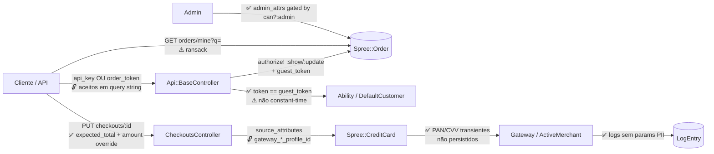

<!-- Gerado por /warroom-audit — Security Auditor (opus) sobre Solidus @ 8d781ac. Evidência arquivo:linha real. -->

# Relatório de Segurança e Privacidade — Módulo de Pedidos/Checkout (Solidus)

## 1. Veredito de Segurança

🟡 **Atenção** — A postura de segurança do módulo de checkout do Solidus é, no geral, **madura e bem arquitetada**: o tratamento de dados de cartão segue o princípio PCI de não-persistência (PAN/CVV transientes), a autorização é baseada em ownership/token com CanCan, e há defesas explícitas contra mass-assignment de atributos administrativos e contra adulteração de preço. Não encontrei vulnerabilidade crítica explorável dentro do escopo analisado (pedidos/checkout/pagamento). Os riscos identificados são de severidade **média/baixa** e concentram-se em (a) exposição de credenciais via query string, (b) mass-assignment de identificadores de perfil de gateway e (c) hardening de comparação de token.

**Vulnerabilidade mais crítica:** mass-assignment de `gateway_customer_profile_id` / `gateway_payment_profile_id` / `wallet_payment_source_id` em `source_attributes`, abrindo a possibilidade de o cliente referenciar um perfil de pagamento de terceiros no gateway (IDOR de meio de pagamento), dependente de validação do lado do gateway.

**Dados sensíveis em risco:** PII de clientes (email, endereço completo, telefone, nome, `vat_id`, IP), `last_digits` de cartão, e — em caso de vazamento de token de pedido — todo o conteúdo do pedido (PII + histórico de compra).

---

## 2. Mapa de Superfície de Ataque



---

## 3. Catálogo de Vulnerabilidades

### Vulnerabilidade #1: Mass-assignment de identificadores de perfil de gateway em `source_attributes`

| Atributo | Detalhe |
|---|---|
| **Categoria OWASP** | A01:2021 – Broken Access Control (IDOR) / A08:2021 – Software & Data Integrity |
| **Severidade** | Média (6/10) |
| **Explorabilidade** | Moderada — depende de validação do gateway |
| **Impacto** | Cliente pode referenciar perfil de pagamento armazenado de outro usuário no gateway |
| **Dados em Risco** | Meios de pagamento tokenizados de terceiros |
| **Privacidade?** | Sim — LGPD art. 6 (segurança) / dados financeiros de terceiros |
| **Evidência no código** | `core/lib/spree/permitted_attributes.rb:106-111` |

**Vetor de ataque:**
1. Atacante autenticado inicia checkout no estado `payment`.
2. Submete `order[payments][][source][gateway_payment_profile_id]` com um ID adivinhado/enumerado de outro cliente (em vez de um PAN).
3. `require_card_numbers?` (`credit_card.rb:169-171`) retorna `false` quando `has_payment_profile?` é verdadeiro, **pulando** as validações de número/CVV; o pagamento é processado contra o perfil informado.

**Código vulnerável:**
```ruby
# core/lib/spree/permitted_attributes.rb:106-111
@@source_attributes = [
  :number, :month, :year, :expiry, :verification_value,
  :first_name, :last_name, :cc_type, :gateway_customer_profile_id,
  :gateway_payment_profile_id, :last_digits, :name, :encrypted_data,
  :wallet_payment_source_id, address_attributes:
]
```

**Correção recomendada:** remover `gateway_customer_profile_id`, `gateway_payment_profile_id` da lista permitida para clientes não-admin (mantê-los apenas no fluxo de importação/admin), e validar ownership de `wallet_payment_source_id` contra `current_api_user`. A exploração real depende de o gateway aceitar profile IDs sem amarração ao customer — confirmar com cada gateway ActiveMerchant em uso. **Confiança média**: é um vetor conhecido, mas a barreira efetiva costuma estar no gateway.

---

### Vulnerabilidade #2: Credenciais sensíveis aceitas via query string (`params[:token]` / `params[:order_token]`)

| Atributo | Detalhe |
|---|---|
| **Categoria OWASP** | A09:2021 – Security Logging Failures / A04:2021 – Insecure Design |
| **Severidade** | Média (5/10) |
| **Explorabilidade** | Moderada (passiva — depende de acesso a logs/proxy/referrer) |
| **Impacto** | Vazamento de API key (credencial de longa duração) ou token de pedido em logs de servidor, proxies, histórico de navegador e cabeçalho `Referer` |
| **Dados em Risco** | `spree_api_key` (acesso total à conta via API), conteúdo do pedido + PII |
| **Privacidade?** | Sim — token de pedido dá acesso a PII completa do pedido (LGPD art. 46) |
| **Evidência no código** | `api/app/controllers/spree/api/base_controller.rb:143,154` |

**Vetor de ataque:**
1. Integração/cliente chama `GET /api/orders/R12345?token=<api_key>` ou `?order_token=<guest_token>`.
2. A URL completa é registrada em logs de acesso (Nginx/Rails), proxies e CDN, e enviada no `Referer` para recursos externos (imagens, scripts).
3. Quem tiver acesso a esses logs recupera a credencial e a reutiliza.

**Código vulnerável:**
```ruby
# base_controller.rb:142-155
def api_key
  bearer_token || params[:token]      # API key aceita em query string
end
def order_token
  request.headers["X-Spree-Order-Token"] || params[:order_token]  # idem
end
```

**Correção recomendada:** aceitar a API key e o order token **apenas** via cabeçalho (`Authorization: Bearer` / `X-Spree-Order-Token`); descontinuar a fonte `params`. Caso a compatibilidade exija, mascarar esses parâmetros no `filter_parameters` do Rails para impedir gravação em log.

---

### Vulnerabilidade #3: Comparação de token de pedido sem tempo constante

| Atributo | Detalhe |
|---|---|
| **Categoria OWASP** | A07:2021 – Identification & Authentication Failures |
| **Severidade** | Baixa (3/10) |
| **Explorabilidade** | Difícil — token de alta entropia mitiga timing side-channel |
| **Impacto** | Teórico: distinção de prefixos de token via timing |
| **Dados em Risco** | Acesso a pedido de convidado |
| **Privacidade?** | Indireto |
| **Evidência no código** | `core/app/models/spree/permission_sets/default_customer.rb:55,58` |

**Análise:** a comparação `token == order.guest_token` usa igualdade de string padrão (curto-circuito), não `ActiveSupport::SecurityUtils.secure_compare`. Na prática o risco é **baixo** porque `create_token` gera o token com `SecureRandom.urlsafe_base64` (alta entropia — `order.rb:885-889`), tornando um ataque de timing inviável. Ainda assim, é boa prática usar comparação constante para segredos.

**Correção recomendada:**
```ruby
order.guest_token.present? &&
  ActiveSupport::SecurityUtils.secure_compare(token.to_s, order.guest_token)
```

---

### Vulnerabilidade #4: Exposição via Ransack em `#mine` / `#index`

| Atributo | Detalhe |
|---|---|
| **Categoria OWASP** | A01:2021 – Broken Access Control |
| **Severidade** | Baixa-Média (4/10) |
| **Explorabilidade** | Moderada |
| **Impacto** | Filtragem/queries por atributos e associações não previstos, dependendo do allowlist de Ransack |
| **Evidência no código** | `api/app/controllers/spree/api/orders_controller.rb:103` (`#mine`), `:67` (`#index`) |

**Análise:** `current_api_user.orders...ransack(params[:q]).result` permite que o cliente injete predicados arbitrários. O escopo está limitado aos pedidos do próprio usuário (`current_api_user.orders`), o que **reduz** o blast radius, mas Ransack sem `ransackable_attributes`/`ransackable_associations` devidamente restritos pode permitir enumeração via associações. O `#index` administrativo (`:67`) é gated por `authorize! :admin, Order`. Verificar se os modelos definem allowlists de Ransack explícitos (versões 4.x exigem).

**Correção recomendada:** garantir `ransackable_attributes`/`ransackable_associations` restritos em `Spree::Order` e modelos associados.

---

### Vulnerabilidade #5 (informativo): `associate_user!` faz bypass de validações via `unscoped.update_all`

| Atributo | Detalhe |
|---|---|
| **Categoria OWASP** | A04:2021 – Insecure Design (defesa em profundidade) |
| **Severidade** | Baixa (3/10) |
| **Evidência no código** | `core/app/models/spree/order.rb:331` |

**Análise:** `self.class.unscoped.where(id:).update_all(attrs_to_set)` ignora callbacks/validações e o default scope. No controller, a operação é **corretamente gated** por `can?(:admin, @order)` (`orders_controller.rb:84`, `checkouts_controller.rb:46`), portanto não é explorável por cliente comum. Risco residual: se algum caller futuro invocar `associate_user!` sem o gate de autorização, há bypass de integridade silencioso. Manter o gate de autorização sempre no caller.

---

## 4. Análise de Autenticação e Autorização

| Endpoint/Fluxo | Autenticação | Autorização (Role) | Ownership Check | Rate Limit | Observação |
|---|---|---|---|---|---|
| `GET /api/orders/:id` (show) | api_key OU order_token | `:show` via Ability | ✅ `order.user == user` OU `token == guest_token` (`base_controller.rb:191`) | Não | OK |
| `PUT /api/orders/:id` (update) | api_key/token | `:update` + `cannot update completed` | ✅ ownership/token | Não | `user_id` só por admin (`orders_controller.rb:84`) ✅ |
| `PUT /api/checkouts/:id` | api_key/token | `:update` por step (`checkouts_controller.rb:17,27,33,43`) | ✅ | Não | `expected_total` anti-tampering ✅ |
| `GET /api/orders/mine` | api_key | implícito (`current_api_user.orders`) | ✅ escopo por usuário | Não | Ransack (ver SEC-004) |
| `GET /api/orders` (index) | api_key | `:admin, Order` ✅ | n/a | Não | Admin-only ✅ |
| `POST/PUT /api/payments .../capture/void` | api_key | `authorize! action, Payment` → admin-only (`payments_controller.rb:31,73`) | ✅ payment via `@order.payments` | Não | Captura/void inacessível a cliente ✅ |
| `GET /api/credit_cards` | api_key | `accessible_by(:show).find(user_id)` (`credit_cards_controller.rb:32`) | ✅ | Não | Sem IDOR ✅ |
| `PUT /api/credit_cards/:id` | api_key | `authorize! :update, @credit_card` (`:38`) → `CreditCard, user_id: user.id` | ✅ | Não | Sem IDOR ✅ |
| `Admin::OrdersController` (todos) | sessão admin | `authorize! action, @order` (`orders_controller.rb:171`) | via permission set | Não | OK |

**Observação positiva:** não há rate limiting no nível da aplicação para os endpoints de checkout/pagamento. Embora não seja uma falha de autorização, recomenda-se rate limit em `/api/checkouts` e tentativas de pagamento (defesa contra card testing / brute force de token).

---

## 5. Auditoria de Secrets e Configuração

| Item | Status | Localização | Risco |
|---|---|---|---|
| PAN (`@number`) | ✅ Transiente (não persistido) | `credit_card.rb:14` | Correto — apenas `last_digits` é gravado (`:102-104`) |
| CVV (`@verification_value`) | ✅ Transiente | `credit_card.rb:14,75-77` | Correto — nunca persistido (PCI DSS) |
| Logs de gateway | ✅ Sem params PII | `payment/processing.rb:236-237` | `basic_response_info` exclui `params` deliberadamente |
| guest_token | ✅ Alta entropia | `order.rb:885-889` (`SecureRandom.urlsafe_base64`) | Forte |
| Atributos admin (mass-assignment) | ✅ Gated por `can?(:admin)` | `orders_controller.rb:151-169`, `base_controller.rb:52-62` | `user_id`, `number`, `state`, `import` só para admin |
| `customer_metadata` em pedido completo | ✅ Bloqueado p/ não-admin | `orders_controller.rb:122-126` | Correto |
| `user_attributes` (email omitido) | ✅ Anti-escalação | `permitted_attributes.rb:137-141` | Email fora dos permitidos — evita privilege escalation |
| Valor do pagamento (anti-tampering) | ✅ Sobrescrito | `checkouts_controller.rb:92` (`set_payment_parameters_amount`) | Cliente não dita o valor cobrado |
| API key / order token em query string | ⚠️ Permitido | `base_controller.rb:143,154` | Ver SEC-002 |
| CSRF | ✅ Adequado p/ API | `base_controller.rb:10` | `protect_from_forgery unless json?` — padrão para API token-based |
| Número do pedido | ⚠️ Enumerável | `order.rb:22-24` (`R` + 9 dígitos, sem letras) | Não é fronteira de segurança (token/ownership exigidos), mas facilita enumeração — risco baixo |

**Nenhum secret hardcoded** (API key, senha, chave) foi encontrado no código analisado.

---

## 6. Análise de Privacidade (LGPD/GDPR)

| Aspecto | Situação | Evidência | Observação |
|---|---|---|---|
| PII tratada | email, nome, endereço, telefone, `vat_id`, IP | `permitted_attributes.rb:42-48`, `order.rb:716` (`last_ip_address`) | Base legal: execução de contrato (compra) — aplicável |
| Dados financeiros | `last_digits`, `cc_type`, perfis de gateway | `credit_card.rb:102,86` | Minimização correta — PAN/CVV não retidos |
| Minimização de log | ✅ params PII excluídos dos logs de gateway | `payment/processing.rb:236-237` | Boa prática |
| IP do cliente armazenado | `last_ip_address` persistido | `order.rb:716` | Definir política de retenção; IP é dado pessoal (LGPD) |
| Vazamento de token = vazamento de PII | order_token dá acesso a pedido com PII completa | `base_controller.rb:191` + SEC-002 | Reforça a prioridade de remover token da query string |
| Direitos do titular (acesso/eliminação) | Não evidenciado no escopo | — | Verificar mecanismo de anonimização/eliminação fora do escopo de checkout |

---

## 7. Plano de Remediação

| Prioridade | Vulnerabilidade | Correção | Esforço | Impacto Privacidade |
|---|---|---|---|---|
| P1 | SEC-001 (mass-assignment gateway profile IDs) | Remover `gateway_*_profile_id` de `source_attributes` para não-admin; validar ownership de `wallet_payment_source_id` | Médio | Sim |
| P1 | SEC-002 (credencial em query string) | Aceitar token/api_key só via header; adicionar `filter_parameters` | Baixo | Sim |
| P2 | SEC-004 (Ransack) | Restringir `ransackable_attributes`/`associations` | Médio | Não |
| P2 | SEC-003 (token não constante) | `SecurityUtils.secure_compare` | Baixo | Não |
| P3 | Rate limiting checkout/pagamento | Throttle em `/api/checkouts` e tentativas de pagamento | Médio | Não |
| P3 | SEC-005 (`update_all` bypass) | Garantir gate de autorização em todo caller de `associate_user!` | Baixo | Não |

---

## Achados (estruturado)

| ID | Título | Severidade (1-10) | Categoria | Arquivo:Linha | Impacto de negócio | Risco técnico |
|---|---|---|---|---|---|---|
| SEC-001 | Mass-assignment de `gateway_customer_profile_id`/`gateway_payment_profile_id`/`wallet_payment_source_id` em `source_attributes` | 6 | A01:2021 (IDOR) / A08:2021 | `core/lib/spree/permitted_attributes.rb:106-111` | Cobrança contra meio de pagamento de outro cliente; fraude/chargeback | Cliente injeta profile ID de terceiro; `require_card_numbers?` pula validação quando há profile (`credit_card.rb:169-171`); exploração depende de validação do gateway |
| SEC-002 | API key e order/guest token aceitos via query string (`params[:token]`/`params[:order_token]`) | 5 | A09:2021 / A04:2021 | `api/app/controllers/spree/api/base_controller.rb:143,154` | Vazamento de credencial de API e de acesso a pedido com PII via logs/Referer | Credencial gravada em logs de servidor, proxy, CDN e enviada no header Referer |
| SEC-003 | Comparação de token de pedido não constante (`token == order.guest_token`) | 3 | A07:2021 | `core/app/models/spree/permission_sets/default_customer.rb:55,58` | Baixo — acesso a pedido de convidado em cenário teórico | Timing side-channel; mitigado por token de alta entropia (`SecureRandom`) |
| SEC-004 | Ransack sem allowlist garantido em `#mine`/`#index` | 4 | A01:2021 | `api/app/controllers/spree/api/orders_controller.rb:103,67` | Possível enumeração/filtragem indevida de dados de pedido | Predicados arbitrários via `params[:q]`; escopo por usuário limita blast radius |
| SEC-005 | `associate_user!` usa `unscoped.update_all` (bypass de validação/callbacks) | 3 | A04:2021 | `core/app/models/spree/order.rb:331` | Risco residual de integridade se chamado sem gate de autorização | Atualmente gated por `can?(:admin)` no controller — não explorável por cliente |
| SEC-006 | Número de pedido enumerável (`R` + 9 dígitos numéricos) | 2 | A04:2021 | `core/app/models/spree/order.rb:22-24` | Facilita enumeração/reconhecimento | Não é fronteira de segurança — token/ownership ainda exigidos; risco amplificado só se combinado com SEC-002 |

**Controles corretos reconhecidos:** PAN/CVV transientes não persistidos (`credit_card.rb:14`); logs de gateway sem params com PII (`payment/processing.rb:236-237`); `guest_token` de alta entropia (`order.rb:885-889`); atributos administrativos protegidos por `can?(:admin)` contra mass-assignment (`orders_controller.rb:151-169`); email fora dos `user_attributes` para impedir escalonamento (`permitted_attributes.rb:137-141`); sobrescrita do valor do pagamento e checagem de `expected_total` contra adulteração de preço (`checkouts_controller.rb:92,18,34`); ausência de IDOR nos controllers de `CreditCard` e `Payment` (autorização por ownership/role).
